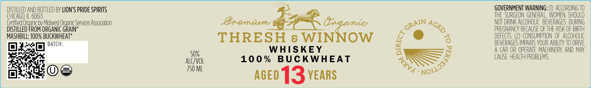

# TTB COLA Label Images - TTBID 26127001000135

**Brand Name:** THRESH & WINNOW

**Fanciful Name:** 100% BUCKWHEAT

**Issue Date:** 05/18/2026

**Origin Code:** 04

**Product Class/Type:** 140

**Source:** [TTB Public COLA Registry](https://ttbonline.gov/colasonline/viewColaDetails.do?action=publicFormDisplay&ttbid=26127001000135)

## Label Images

### Label 1

### Label 2

## Extracted Label Text

*Text extracted via OCR - may contain errors*

**Detected Proof:** 100

### Label 1

DISTILLED AND BOttLeD BV LION'S PRIDE SPIRITS
GOVERNMENT WARNING: '
ACcORDING TO
CHIcAGO;
60613
THE   SURGEON  GENERAL  WOMEN  SHOULD
Gertified Organic bv Midwest Orgaric Services Association
Gxemiumm
8nqamic
NOT DRINK ALCOHOLIC   BEVERAGES  DURING
DISTILLED FROM ORGANIC GRAIN*
PREGNANCY BECAUSE OF THE RISK OF BIRTH
MASHBILL; 100% BUCKWHEAT*
THRESH
8
WINNOW
6
DeFECTS
CONSUMPTHON OF ALCOHOLIC
BATCH:
BEVERAGES IMPAIRS YOUR ABILITY TO DRIVE
WHISKEY
A CAR OR OPERATE MACHINERY AND MAY
50%
10 0 %
BUC KWHEAT
CAUSE HEALTH PROBLEMS
ALCVOL
VSDA
750 ML
aged13YEARS
GRAIN
AGED
6
Nojlj3aaoe
WTVA

### Label 2

LIMITED

RELEASE

TOASTED BARREL EDITION

SINGLE CASK
