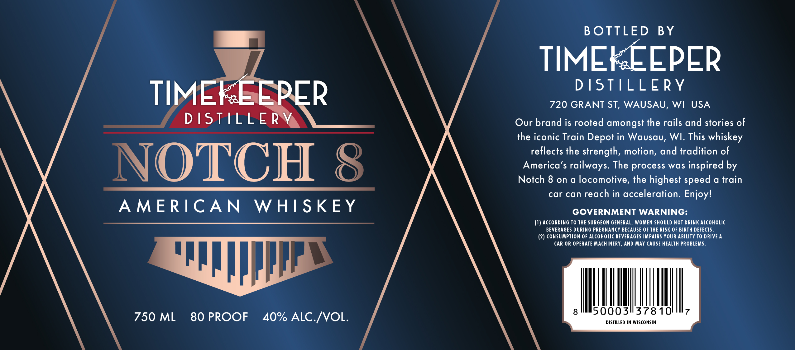

# TTB COLA Label Images - TTBID 26127001000138

**Brand Name:** TIMEKEEPER DISTILLERY

**Fanciful Name:** NOTCH 8

**Issue Date:** 05/13/2026

**Origin Code:** 48

**Product Class/Type:** 140

**Source:** [TTB Public COLA Registry](https://ttbonline.gov/colasonline/viewColaDetails.do?action=publicFormDisplay&ttbid=26127001000138)

## Label Images

### Label 1

## Extracted Label Text

*Text extracted via OCR - may contain errors*

**Detected Proof:** 80

### Label 1

B OTTLED
BY
TIMEL EEPER
DSTILLERy
TIMETEEPER
720 GRANT ST, WAUSAU, WI
USA
DSTLLERV
Our brand is rooted amongst the rails and stories of
the iconic Train Depot in Wausau; WI. This whiskey
reflects the strength, motion, and tradition of
NOTCH 8
America'$ railways. The process was inspired by
Notch 8 on a locomotive, the highest speed a train
car can reach in acceleration. Enjoyl
A MERICAN
WHISKEY
GOVERNMENT WARNING:
AccoRding To THE SURGEON GENERAL, WOMEN SHOULD NOT DRINK ALCOHOLIC
BEVERAGES DURING PREGNANCY BECAUSE 0F THE RISK OF BIRTH DEFECTS_
(2) CONSUMPTION OF ALCOHOLIC BEVERAGES IMPAIRS YOUR ABILITY TO DRIVE A
CAR OR OPERATE MAcHINERY, AND MAY CAUSE HEALTH PROBLEMS
8
5000311378 101
7
750 ML
80 PROOF
40% ALC /VOL.
DISTILLED IN WISCONSIN
