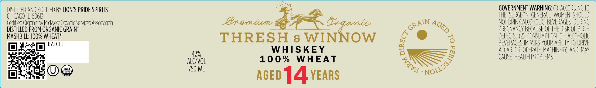

# TTB COLA Label Images - TTBID 26127001000141

**Brand Name:** THRESH & WINNOW

**Fanciful Name:** 100% WHEAT

**Issue Date:** 05/18/2026

**Origin Code:** 04

**Product Class/Type:** 140

**Source:** [TTB Public COLA Registry](https://ttbonline.gov/colasonline/viewColaDetails.do?action=publicFormDisplay&ttbid=26127001000141)

## Label Images

### Label 1

### Label 2

## Extracted Label Text

*Text extracted via OCR - may contain errors*

**Detected Proof:** 84

### Label 1

DISTILLED AND BOTTLED BV LIONS PRIDE SPIRITS
GOVERNMENT WARNING: '
ACcORDING TO
CHIcAGO;
60613
THE SURGEON  GENERAL  WOMEN  SHOULD
Gertified Organic bv Midwest Organic Services Association
Bxemiumu
8rqamic
NOT DRINK ALCOHOLIC   BEVERAGES  DURING
DISTILLED FROM ORGANIC GRAIN*
PREGNANCY BECAUSE OF THE RISK OF BIRTH
MASHBILL: 100% WHEAT*
THRESH
8 WINNOW
6
DEFECTS
CONSUMPTION  OF  ALCOHOLIC
BATCH;
BFVFRAGES IMPAIRS YOUR ABILITY TO DRIVE
WHISKEY
A CAR OR OPERATE MACHINERV AND MAY
42%
10 0 %
WHEAT
CAUSE HEALTH PROBLEMS
ALCVOL
VSQA
750 ML
abed14YEARs
GRAIN
AGED
0
Nojlj3aaoo
'WTVA

### Label 2

LIMITED

RELEASE

TOASTED BARREL EDITION

SINGLE CASK
