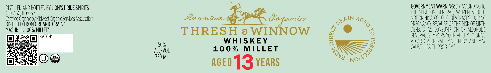

# TTB COLA Label Images - TTBID 26127001000148

**Brand Name:** THRESH & WINNOW

**Fanciful Name:** 100% MILLET

**Issue Date:** 05/18/2026

**Origin Code:** 04

**Product Class/Type:** 140

**Source:** [TTB Public COLA Registry](https://ttbonline.gov/colasonline/viewColaDetails.do?action=publicFormDisplay&ttbid=26127001000148)

## Label Images

### Label 1

### Label 2

## Extracted Label Text

*Text extracted via OCR - may contain errors*

*1 image(s) excluded: text did not meet readability threshold*

**Detected Proof:** 100
**Detected Age:** 13 Years

### Label 1

DISTILLED AnD BOTTLED BY LIONS PRIDE SPIRITS
GOVERNMENT WARNING; '
ACCORDING TO
chicAGO;
60613
THE   SURGEON  GENERA L WOMEN  SHOULD
(ertified Organicbv Midlwest Organic Services Association
Bremium
Erdamic
NOT DRINK ALCOHOLIC   BEVERAGES  DURING
DISTILLED FROM ORGANIC GRAIN*
PREGNANCY BECAUSE OF THE RISK OF BIRTH
MASHBILL: 100% MHLLET*
THRESH
8 WINNOW
8
DEFECTS
CONSUMPTION  OF  ALCOHOLIC
BATCH:
BEVERAGES IMPAIRS VOUR ABILITY TO DRIVE
WHISKEY
A CAR OR OPERATE MACHINERY AND MAY
50%
10 0 %
MILLET
CAUSE HEALTH PROBLEMS
alcvol
USDA
750 L
TNAAM
AGED
13YEARS
GRAIN
AGED
6
1o1133a88o
WUVA
