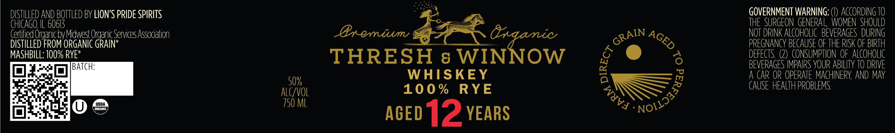

# TTB COLA Label Images - TTBID 26127001000153

**Brand Name:** THRESH & WINNOW

**Fanciful Name:** 100% RYE

**Issue Date:** 05/18/2026

**Origin Code:** 04

**Product Class/Type:** 140

**Source:** [TTB Public COLA Registry](https://ttbonline.gov/colasonline/viewColaDetails.do?action=publicFormDisplay&ttbid=26127001000153)

## Label Images

### Label 1

## Extracted Label Text

*Text extracted via OCR - may contain errors*

**Detected Proof:** 100
**Detected Age:** 12 Years

### Label 1

DISTILLED AnD BOTTLED BY LIONS PRIDE SPIRITS
GOVERNMENT WARNING; '
ACCORDING TO
cHIcAGO, IL 60613
THE SURGEON  GENERAL  WOMEn  SHOULD
(ertified Organicbv Midwest Organic_ Services Assocation
Gxomium
Onqamnic
NOT DRINK ALCOHOLIC   BEVERAGES  DURING
DISTILLED FROM ORGANIC GRAIN*
PREGNANCY BECAUSE OF THE RISK OF BIRTH
MASHBILL: 100% RYE*
THRESH 8 WINNOW
8
DEFECTS (2) conSuMPTION  OF  ALCOHOLIC
BATCH:
BEVERAGES IMPAIRS YOUR ABILITY TO DRIVE
WHISKEY
A CAR OR OPERATE MAcHINERY AND MAY
50%
10 0 %
RYE
CAUSE HEALTH PROBLEMS
alcyvol
USDA
750 ML
Jnramm
AGed 12 YEARS
GRAIN
AGED
0
NoI1JIaa >
WUVA
