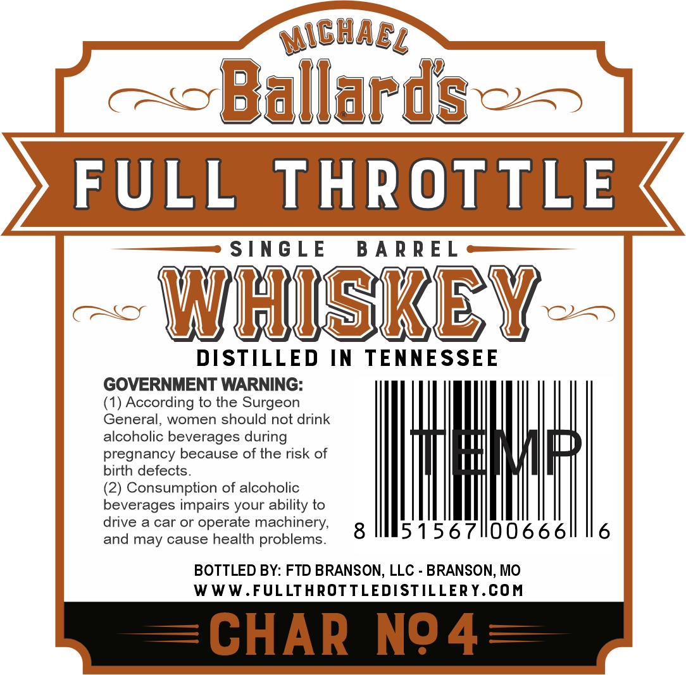
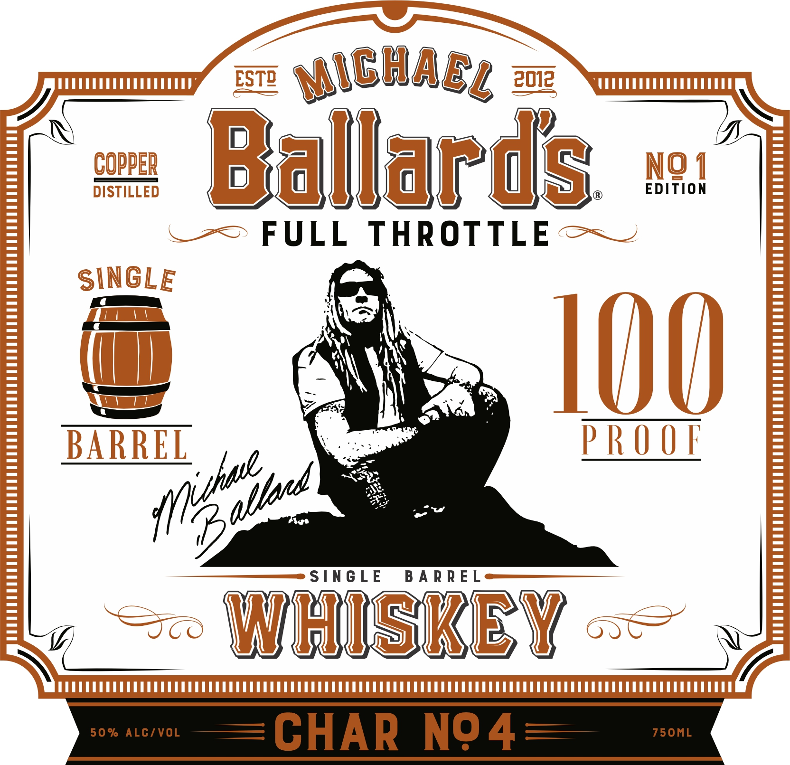
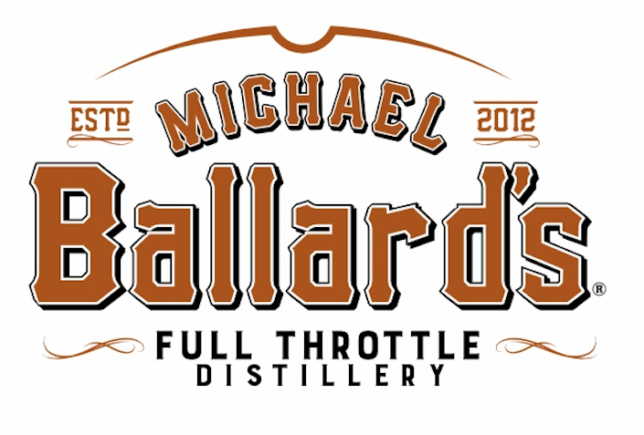

# TTB COLA Label Images - TTBID 26127001000228

**Brand Name:** FULL THROTTLE

**Issue Date:** 05/12/2026

**Origin Code:** 29

**Product Class/Type:** 140

**Source:** [TTB Public COLA Registry](https://ttbonline.gov/colasonline/viewColaDetails.do?action=publicFormDisplay&ttbid=26127001000228)

## Label Images

### Back Label

### Front Label

### Label 3

## Extracted Label Text

*Text extracted via OCR - may contain errors*

**Detected Proof:** 100

### Back Label

wich AE /

Ballards—-
FULL THROTTLE

SINGLE BARREL

~~ WHISKEY--

DISTILLED IN TENNESSEE

GOVERNMENT WARNING:

(1) According to the Surgeon
General, women should not drink
alcoholic beverages during

pregnancy because of the risk of

birth defects

(2) Consumption of alcoholic
beverages impairs your ability to

drive a car or operate machinery, 8
and may cause health problems.

p

51567I1l006661 16

BOTTLED BY: FTD BRANSON, LLC - BRANSON, MO
WWW.FULLTHROTTLEDISTILLERY.COM

=CHAR NO

### Front Label

ESTD
MiGhael %
COPPER
Ballards
EDITION
NQ 1
DISTILLED
FULL
THROTTLE
SINGLE
I00
BARREL
PROOF
D
S[NG LE
B A R R E L
WhUSKEY
50 % ALC/VOL
CHAR
N94
750ML
TPuhaw
alland [

### Label 3

ESTR
MiChacl @
Ballards
FULL
THROTTLE
D / S TIL L E R Y
