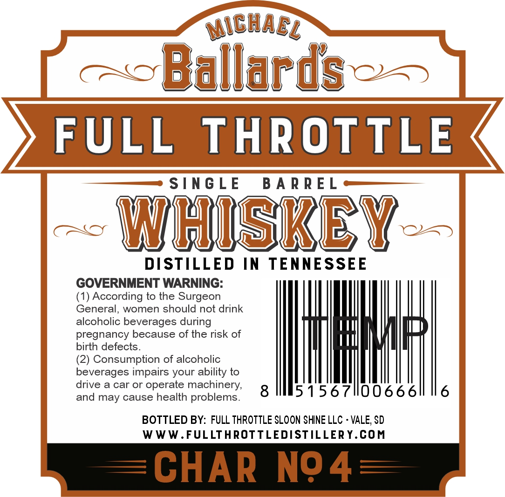

# TTB COLA Label Images - TTBID 26127001000231

**Brand Name:** FULL THROTTLE

**Issue Date:** 05/12/2026

**Origin Code:** 42

**Product Class/Type:** 140

**Source:** [TTB Public COLA Registry](https://ttbonline.gov/colasonline/viewColaDetails.do?action=publicFormDisplay&ttbid=26127001000231)

## Label Images

### Back Label

### Front Label

### Label 3

## Extracted Label Text

*Text extracted via OCR - may contain errors*

**Detected Proof:** 100

### Back Label

Michacz
Ballards
FULL
THROTTLE
STNGLE
B A R R E L
WhISKEY
DISTILLED
IN
TENNESSEE
GOVERNMENT WARNING:
(1) According to the Surgeon
General;,
women should not drink
alcoholic beverages during
pregnancy because of the risk of
birth defects_
(2) Consumption of alcoholic
beverages impairs your ability to
drive
a car Or
operate machinery,
and may cause health problems_
8
5156711006661
6
BOTTLED BY: FULL THROTTLE SLOON SHINE LLC
VALE; SD
WWW.FULLTHROTTLEDISTILLER Y.COM
CHAR
N94

### Front Label

ESTD
MiGhael %
COPPER
Ballards
EDITION
NQ 1
DISTILLED
FULL
THROTTLE
SINGLE
I00
BARREL
PROOF
D
S[NG LE
B A R R E L
WhUSKEY
50 % ALC/VOL
CHAR
N94
750ML
TPuhaw
alland [

### Label 3

ESTR
MiChacl @
Ballards
FULL
THROTTLE
D / S TIL L E R Y
