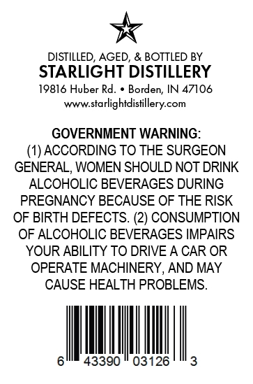
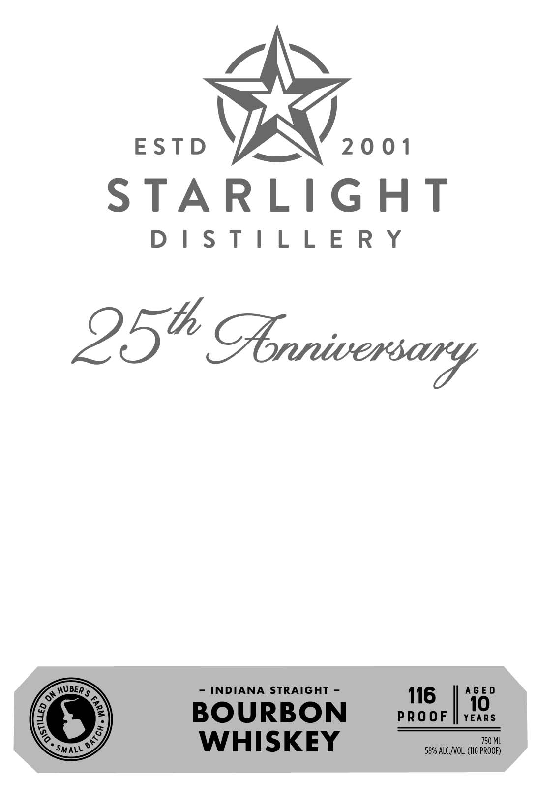
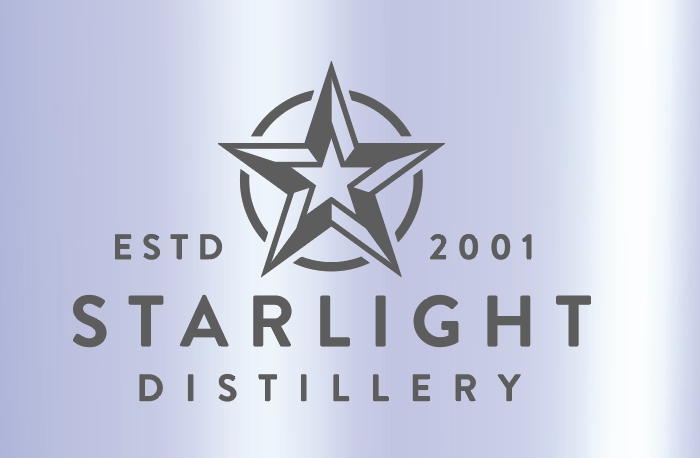

# TTB COLA Label Images - TTBID 26127001000306

**Brand Name:** STARLIGHT DISTILLERY

**Issue Date:** 05/15/2026

**Origin Code:** 19

**Product Class/Type:** 101

**Source:** [TTB Public COLA Registry](https://ttbonline.gov/colasonline/viewColaDetails.do?action=publicFormDisplay&ttbid=26127001000306)

## Label Images

### Back Label

### Front Label

### Label 1

## Extracted Label Text

*Text extracted via OCR - may contain errors*

*2 image(s) excluded: text did not meet readability threshold*

### Back Label

DISTILLED, AGED, & BOTTLED BY
STARLIGHT DISTILLERY
19816 Huber Rd:
Borden, IN 47106
www.starlightdistillery com
GOVERNMENT WARNING:
(1) ACCORDING TO THE SURGEON
GENERAL, WOMEN SHOULD NOT DRINK
ALCOHOLIC BEVERAGES DURING
PREGNANCY BECAUSE OF THE RISK
OF BIRTH DEFECTS. (2) CONSUMPTION
OF ALCOHOLIC BEVERAGES IMPAIRS
YOUR ABILITY TO DRIVE A CAR OR
OPERATE MACHINERY, AND MAY
CAUSE HEALTH PROBLEMS.
43390
03126
