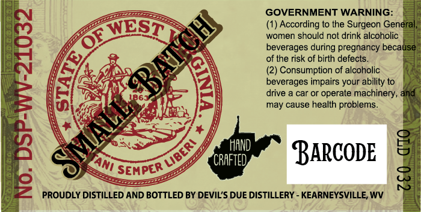
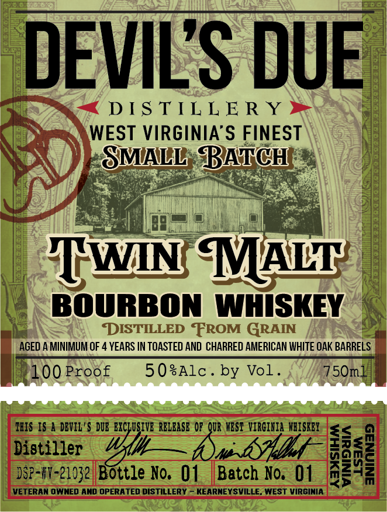
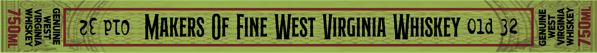

# TTB COLA Label Images - TTBID 26127001000335

**Brand Name:** DEVIL'S DUE DISTILLERY

**Fanciful Name:** TWIN MALT BOURBON

**Issue Date:** 05/21/2026

**Origin Code:** 47

**Product Class/Type:** 111

**Source:** [TTB Public COLA Registry](https://ttbonline.gov/colasonline/viewColaDetails.do?action=publicFormDisplay&ttbid=26127001000335)

## Label Images

### Back Label

### Front Label

### Label 2

### Label 4

## Extracted Label Text

*Text extracted via OCR - may contain errors*

**Detected Proof:** 100
**Detected Age:** 4 Years

### Back Label

GOVERNMENT WARNING:
WES
According to the Surgeon General
women should not drink alcoholic
beverages during pregnancy because
of the risk of birth defects
Consumption of alcoholic
1
5
deverager or operare achinery,
and
may cause health problems
LRX
HAND
BARCODE
8
CRAFTED
8
2
PROUDLY DISTILLED AND BOTTLED BY DEVIL'S DUE DISTILLERY - KEARNEYSVILLE; WV
BATZH
QF
E6
0
MIALLS
LibeRI
TAnI
SEMPER ~

### Front Label

DEVILS DUE
DIS TIL L E R Y
WEST VIRGINIA'S FINEST
SMALL BATCH
HWN MALT
BOURBON WHISKEY
DISTILLED
FROM GRAIN
AGED A MINIMUM OF 4 YEARS IN TOASTED AND CHARRED AMERICAN WHITE OAK BARRELS
100 Proof
5 0sAlc _
by Vol _
750ml
IRIS IS | DEVIL '$ DUE EXCLUSIVE RELEASE OF QUR WBST ViRCIHIA  WBiSKEY
<
Disti-zexg Boyyle Ho, 01
Batch No. 01
1
M
3
VETERAN OWNED AND OPERATED DISTILLERY
KEARNEYSVILLE. WEST VIRGINIA

### Label 2

BOTTLED
IN
BOND
SINGLE BARREL SELECT

### Label 4

ASXSIHM
VINISUIA
LSaM
ANINNASD

WHISKEY

2€ oto MAKERS QF FINE WEST VIRGINIA WHISKEY 014 32 | 686
