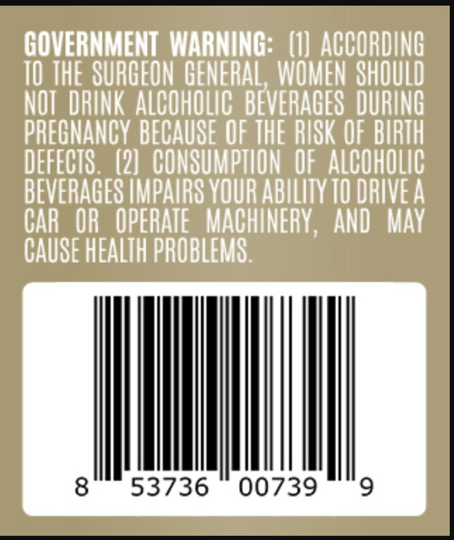
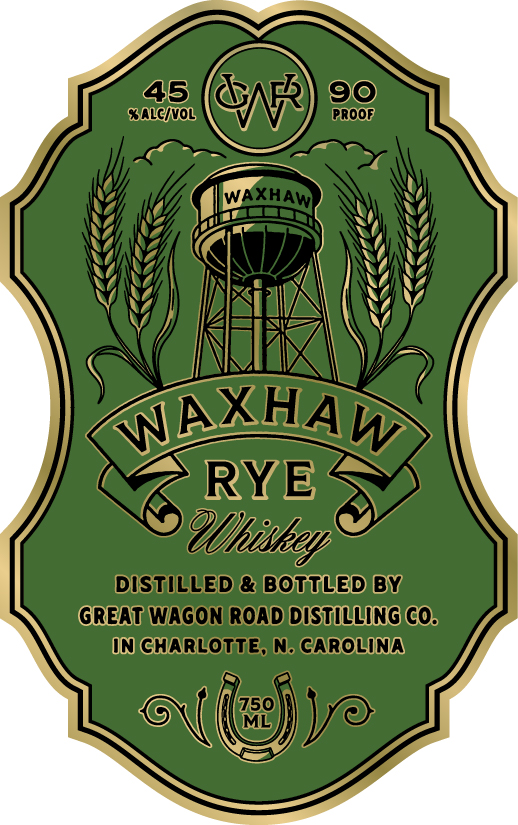

# TTB COLA Label Images - TTBID 26127001000337

**Brand Name:** WAXHAW

**Fanciful Name:** WAXHAW RYE

**Issue Date:** 05/13/2026

**Origin Code:** 35

**Product Class/Type:** 142

**Source:** [TTB Public COLA Registry](https://ttbonline.gov/colasonline/viewColaDetails.do?action=publicFormDisplay&ttbid=26127001000337)

## Label Images

### Back Label

### Label 1

## Extracted Label Text

*Text extracted via OCR - may contain errors*

### Back Label

GOVERNMENT  WARNING:   (1] ACCORDING
10 THE SURCFON GENERAL, WOMEN SHOULD
NOT  DRINK ALCOHOLIC   BEVERAGES  DURING
PRECNANCY BECAUSE OF THE RISK OF BIRTH
DEFECTS   (21   CONSUMPTLON  OF alcohOlIC
BEVERAGES IMPAIRS VOUR AbILITY TO DRIVEA
CAR   OR   OPERATE   MACHINERV,
ANd   May
CAUSE HEALTH PROBLEMS .
8
53736
00739
9

### Label 1

45
GN
90
alcivol
Proop
WAXhAw
WAXHAW
RYE
 @Uhisken
DISTILLED & BOTTLED BY
GREAT WAGON ROAD DISTILLING COs
In ChARLOTTE, n. Carolina
(759)
