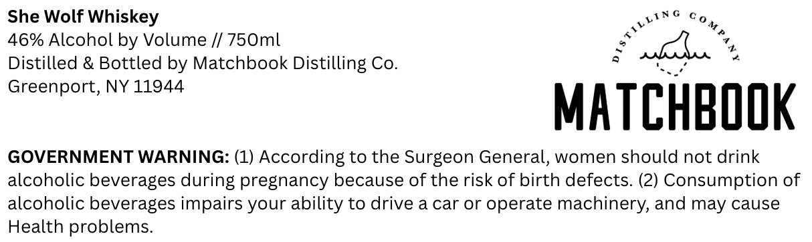

# TTB COLA Label Images - TTBID 26127001000419

**Brand Name:** MATCHBOOK DISTILLING CO

**Issue Date:** 05/13/2026

**Origin Code:** 02

**Product Class/Type:** 140

**Source:** [TTB Public COLA Registry](https://ttbonline.gov/colasonline/viewColaDetails.do?action=publicFormDisplay&ttbid=26127001000419)

## Label Images

### Label 1

## Extracted Label Text

*Text extracted via OCR - may contain errors*

**Detected Proof:** 92

### Label 1

yING Og

She Wolf Whiskey

46% Alcohol by Volume // 750ml

Distilled & Bottled by Matchbook Distilling Co.

Greenport, NY 11944

MAT

CHBOOK

GOVERNMENT WARNING: (1) According to the Surgeon General, women should not drink

alcoholic beverages during pregnancy because of the risk of birth defects. (2) Consumption of

alcoholic beverages impairs your ability to drive a car or operate machinery, and may cause

Health problems.
