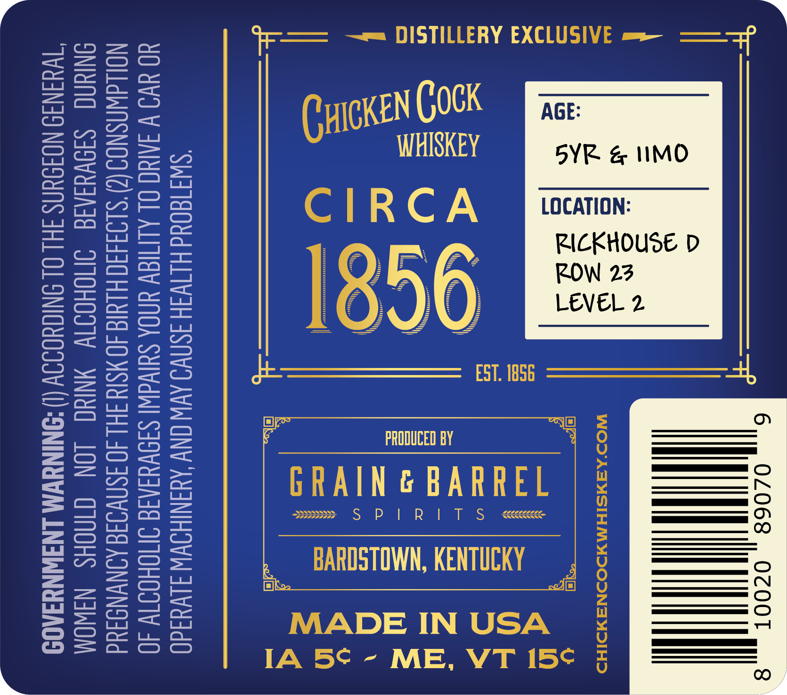
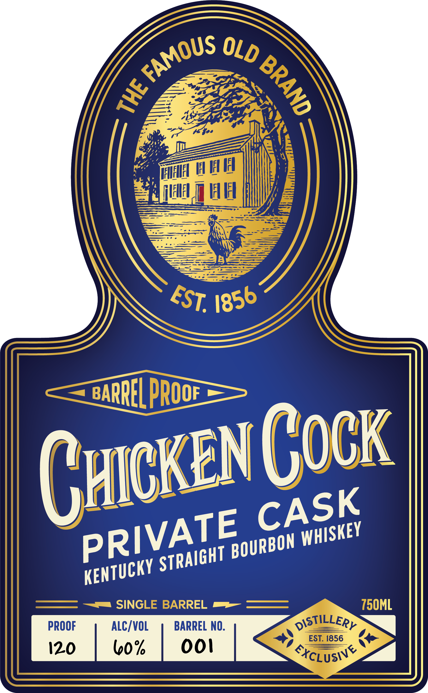

# TTB COLA Label Images - TTBID 26127001000474

**Brand Name:** CHICKEN COCK

**Issue Date:** 05/13/2026

**Origin Code:** 22

**Product Class/Type:** 101

**Source:** [TTB Public COLA Registry](https://ttbonline.gov/colasonline/viewColaDetails.do?action=publicFormDisplay&ttbid=26127001000474)

## Label Images

### Back Label

### Front Label

### Label 3

## Extracted Label Text

*Text extracted via OCR - may contain errors*

*1 image(s) excluded: text did not meet readability threshold*

### Back Label

02068 , OCOOT

\ |

fay
@)
= a
= DS
os 2
eo eS
wn w

=
=
=
<x
uw
o
—_

‘SWIT8OUd HITWIH ISNVO AVW ONY AMANIHOWW JLVYsd0
YO WO V IAEC OL ALIMY YNOA SUIVGWI SISVYSAIG INOHOITW 40
NOLLdWASNOS (2)'S193490 HUNG 40 SIN HL 40 ISNVIIG AINWNDAUd
ONIUNG =S3IVYSAIE INCHOIIV NYC LON GINOHS NAWOM
“TWUINI9 NOFDUNS FHL OL SNITHOISY (1) -ONINYWM LNIWNYFADS

a ag

### Front Label

F
@hh
[VFWF
HH
BARREL PROOE_
Cucken Cock
SINGLE BARREL
750ML
PROOF
ALC/VOL
BARREL NO:
DISTILLERY
EST. 1856
120
bo%
ooi
SxCLUSIY
FAMOUS
OLD
3
4
EST.
1856
CASK
PRIVATE
WHISKEY
BOURBON
STRAIGHT
KENTUCKY
