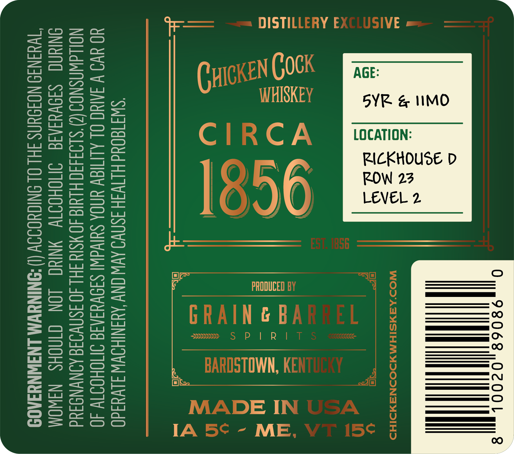
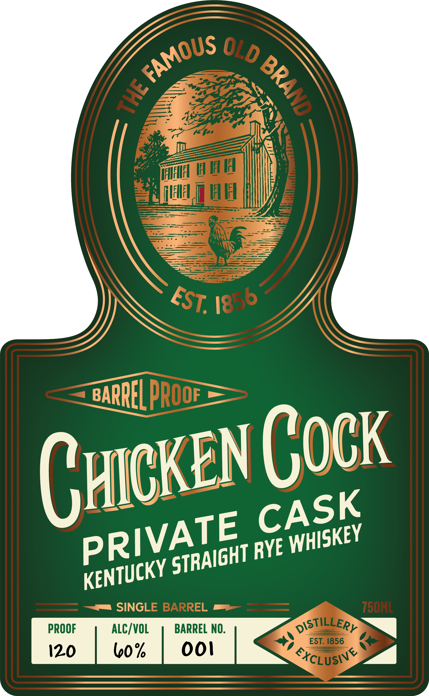
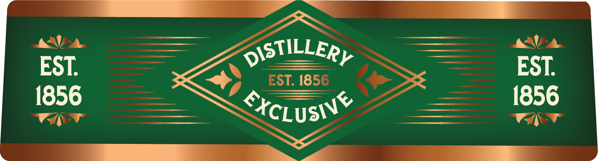

# TTB COLA Label Images - TTBID 26127001000479

**Brand Name:** CHICKEN COCK

**Issue Date:** 05/13/2026

**Origin Code:** 22

**Product Class/Type:** 102

**Source:** [TTB Public COLA Registry](https://ttbonline.gov/colasonline/viewColaDetails.do?action=publicFormDisplay&ttbid=26127001000479)

## Label Images

### Back Label

### Front Label

### Label 3

## Extracted Label Text

*Text extracted via OCR - may contain errors*

*1 image(s) excluded: text did not meet readability threshold*

### Back Label

Y |

DISTI

0 ),98068 Hil 8

RICKHOUSE D

2)
=
wt
w
>
i<y)

LOCATION:
ROW 23
LEVEL 2

‘SWI180Ud HLIVIH ASNWO AV ONY AYANIHOWW JLVu4d0
YO VO V IAC OL ALIMIAY UNDA SUIVWI SISVYSAIG INOHOTTW 40
NOLLAWASNOD(2)’S193430 HIG 40 MSI FHL 40 ISNVIIE AINYNDTUd
ONIUAG SIOVYIAIE IJNOHOITY MNIUC LON CINOHS NaWOM
"TWUINI9 NOISUNS JH! OL SNIGHOIOV (!) ‘SNINYWM LNIWNYIAOD

### Front Label

HIHIEL
IE H
BARREL pROOE_
SINGLE BARREL
750ML
PROOF
ALC/VOL
BARREL NO:
DISTILLERy
EST. [856
120
bo%
ooi
SxCLUSIY
FAMOUS
OLD
8
4
EST.
1856
CHcKEN Cock
CASK
PRIVATE
WHISKEY
RYE
STRAIGHT
KENTUCKY
