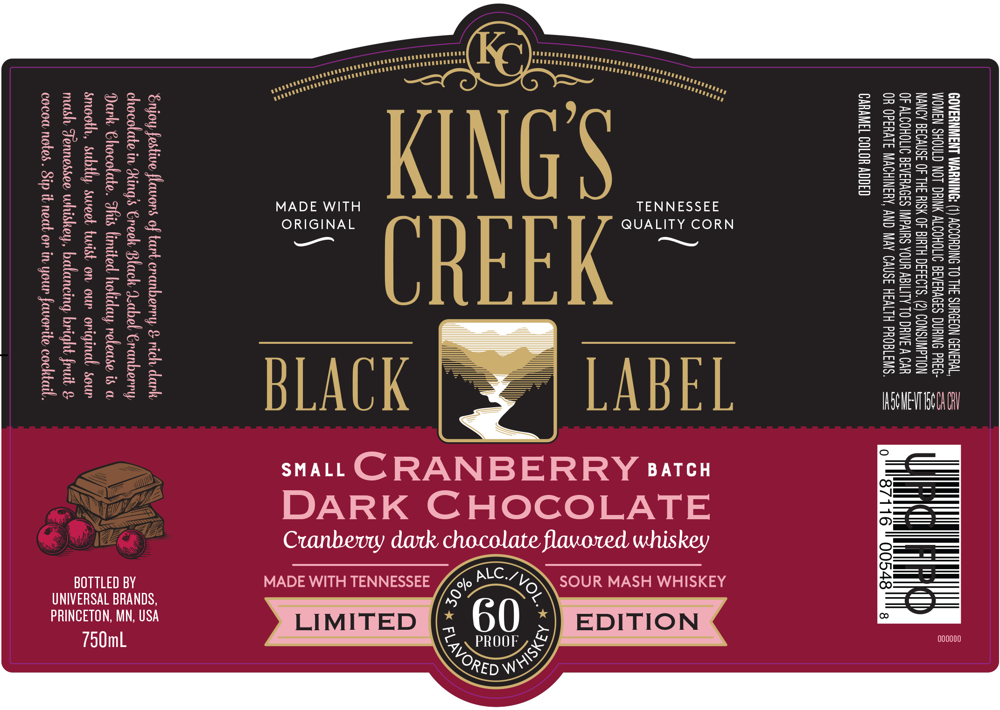
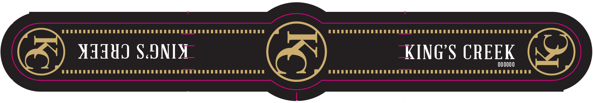

# TTB COLA Label Images - TTBID 26127001000538

**Brand Name:** KING'S CREEK

**Fanciful Name:** CRANBERRY DARK CHOCOLATE

**Issue Date:** 05/14/2026

**Origin Code:** 27

**Product Class/Type:** 149

**Source:** [TTB Public COLA Registry](https://ttbonline.gov/colasonline/viewColaDetails.do?action=publicFormDisplay&ttbid=26127001000538)

## Label Images

### Label 1

### Label 2

## Extracted Label Text

*Text extracted via OCR - may contain errors*

*1 image(s) excluded: text did not meet readability threshold*

### Label 1

GOVERNMENT WARNING: (1) ACCORDING TO THE SURGEON GENERAL,
WOMEN SHOULD NOT DRINK ALCOHOLIC BEVERAGES DURING PREG-
NANCY BECAUSE OF THE RISK OF BIRTH DEFECTS. (2) CONSUMPTION
OF ALCOHOLIC BEVERAGES IMPAIRS YOUR ABILITY TO DRIVE A CAR
OR OPERATE MACHINERY, AND MAY CAUSE HEALTH PROBLEMS. === (AMUMkswatrculweyet-wt

CARAMEL COLOR ADDED

000000

SGWEVT TSCA Al

TENNESSEE
QUALITY CORN
—

—
—-
pO
—
—

EDITION

SOUR MASH WHISKEY

=
<2
=
C=
Cc

LIMITED

DARK CHOCOLATE

Cranbevy dark chocolate flavored whiskey

sMALLCRANBERRY satcu

ORIGINAL
—
MADE WITH TENNESSEE

BLACK

Enjoy festive flavors of tart cranberry & rich dark,
chocolate in King’s Greek Black d.abel Cranberry
Dark Chocolate. This limited holiday release is a
smooth, subtly sweet twist on our original sour
mash Fennessee whiskey, balaneing bright fruit &

cocow notes. Sip it neat on in your favorite cocktail.

BOTTLED BY

UNIVERSAL BRANDS,

PRINCETON, MN, USA
750mL
