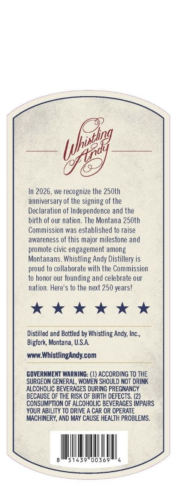
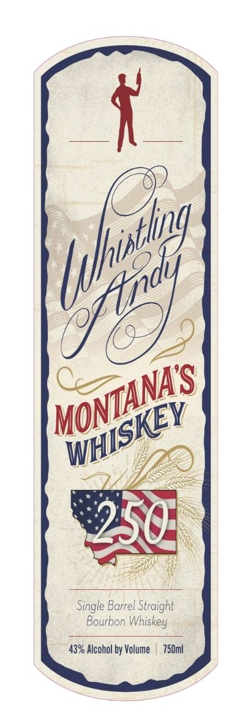
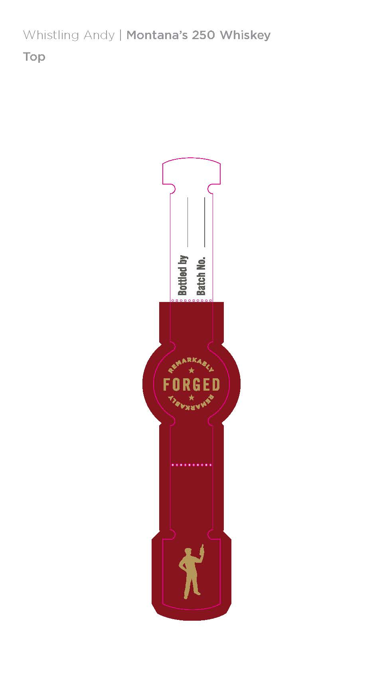

# TTB COLA Label Images - TTBID 26127001000591

**Brand Name:** WHISTLING ANDY

**Fanciful Name:** MONTANA'S 250 WHISKEY

**Issue Date:** 05/21/2026

**Origin Code:** 30

**Product Class/Type:** 101

**Source:** [TTB Public COLA Registry](https://ttbonline.gov/colasonline/viewColaDetails.do?action=publicFormDisplay&ttbid=26127001000591)

## Label Images

### Back Label

### Front Label

### Label 3

## Extracted Label Text

*Text extracted via OCR - may contain errors*

**Detected Proof:** 86

### Back Label

In 2026, we recognize the 250th
anniversary of the signing of the
Declaration of Independence and the
birth of our nation. The Montana 250th
Commission was established to raise
awareness of this major milestone and
promote civic engagement among
Montanans. Whistling Andy Distillery is
proud to collaborate with the Commission
to honor our
founding and celebrate our
nation: Here'$ to the next 250 years!
Distilled and Bottled by Whistling Andy; Inc_,
Bigfork, Montana; USA
www.WhistlingAndy com
GOVERNMENT WARNING: (1) ACCORDING TO THE
SURGEON GENERAL, WOMEN SHOULD NOT DRINK
ALCOHOLIC BEVERAGES DURING PREGNANCY
BECAUSE OF THE RISK OF BIRTH DEFECTS:
CONSUMPTION OF ALCOHOLIC BEVERAGES IMPAIRS
YOUR ABILITY TO DRIVE A CAR OR OPERATE
MACHINERY, AND MAY CAUSE HEALTH PROBLEMS,
1439
0036
[xhhirthng
244

### Front Label

ndy
250]
Single Barrel
ht
Bourbon Whiskey
43% Alcohol by Volume
750ml
hhinthng
MONTANAS
WHISKEY
Straig"

### Label 3

Whistling Andy
Montana's 250 Whiskey
0
FORGED
Ivxtvp
Top
