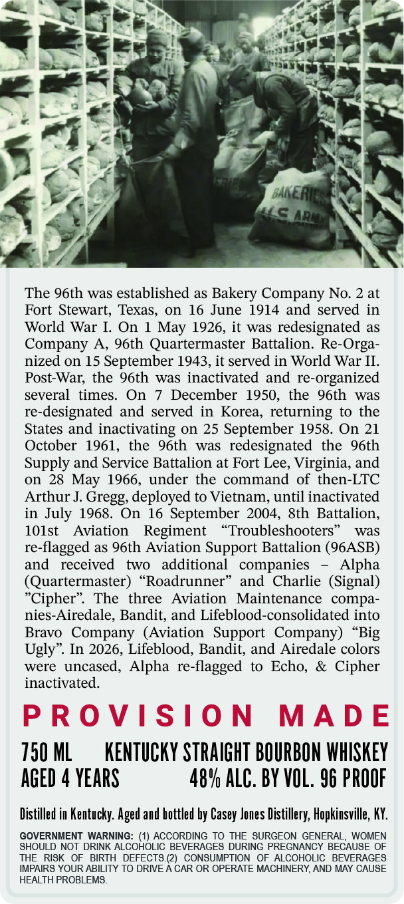
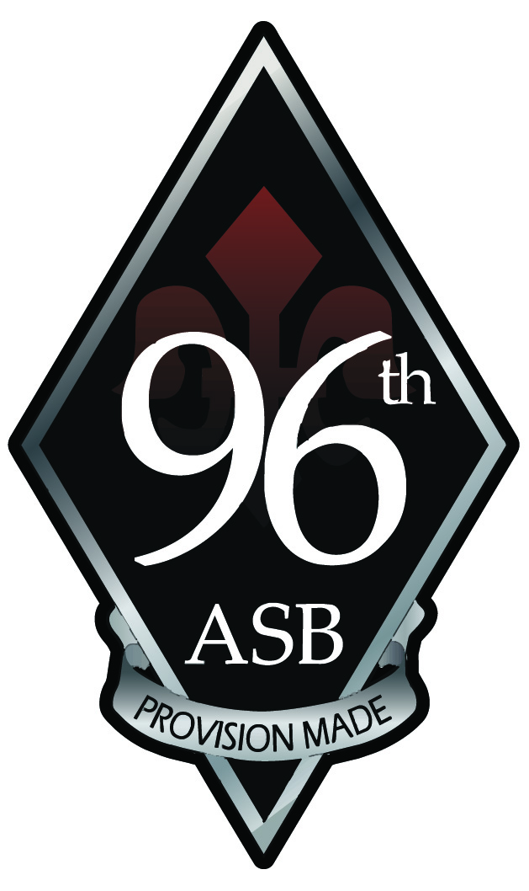

# TTB COLA Label Images - TTBID 26127001000663

**Brand Name:** PROVISION MADE

**Issue Date:** 05/13/2026

**Origin Code:** 22

**Product Class/Type:** 101

**Source:** [TTB Public COLA Registry](https://ttbonline.gov/colasonline/viewColaDetails.do?action=publicFormDisplay&ttbid=26127001000663)

## Label Images

### Back Label

### Front Label

### Label 3

## Extracted Label Text

*Text extracted via OCR - may contain errors*

*1 image(s) excluded: text did not meet readability threshold*

**Detected Proof:** 96

### Back Label

BAKERI:
MSAR
The 96th was established as Bakery Company No. 2 at
Fort Stewart; Texas, on 16 June 1914 and served in
World War I.
On
May 1926, it was redesignated as
Company A
96th Quartermaster Battalion. Re
nized on 15 September 1943,it served in World War II:
Post-War; the 96th was inactivated and
re-
-organized
several
times_
On
December 1950,
the
96th
was
re-
designated and served
in Korea, returning to the
States and inactivating on 25 September 1958. On 21
October 1961,
the
96th
was   redesignated
the
96th
Supply and Service Battalion at Fort Lee, Virginia, and
on
28 May 1966, under the command of then-LTC
Arthur J.
Gregg; deployed to Vietnam, until inactivated
in July 1968. On
16 September 2004, &th Battalion,
101st
Aviation
Regiment
Troubleshooters
was
re
-flagged as 96th Aviation Support Battalion (96ASB)
and
received
two
additional   companies
Alpha
(Quartermaster)
Roadrunner
and
Charlie  (Signal)
Cipher"
The   three
Aviation   Maintenance
compa-
nies-Airedale, Bandit, and Lifeblood-consolidated into
Bravo   Company (Aviation   Support  Company
Ugly". In 2026, Lifeblood, Bandit, and Airedale colors
were   uncased, Alpha re-flagged to
Echo,
Cipher
inactivated:
P R O VIS/0 N
MAD E
750 ML
KENTuCKY STRAIGHT BOURBON WHISKEY
AGED
YEARS
48V ALC. BY VOL. 96 PROOF
Distilled in Kentucky: Aged and hottled by Casey Jones Distillery, Hopkinsville, KY:
GOVERNMENT WARNING:
ACCORDING TO
THE SURGEON GENERAL;
WOMEN
SHOULD NOT DRINK ALCOHOLIC BEVERAGES DURING PREGNANCY BECAUSE OF
THE  RISK
BIRTH   DEFECTS (2)   CONSUMPTION  OF
ALCOHOLIC   BEVERAGES
IMPAIRS YOUR ABILITY TO DRIVE A CAR OR OPERATE MACHINERY, AND MAY CAUSE
HEALTH PROBLEMS.
Orga-
"Big

### Label 3

pqROUBLESHOOT ER.
whe
ge
1 efas
ye” |
Mais
‘Ry
POVision wESY
SINCE 1914
