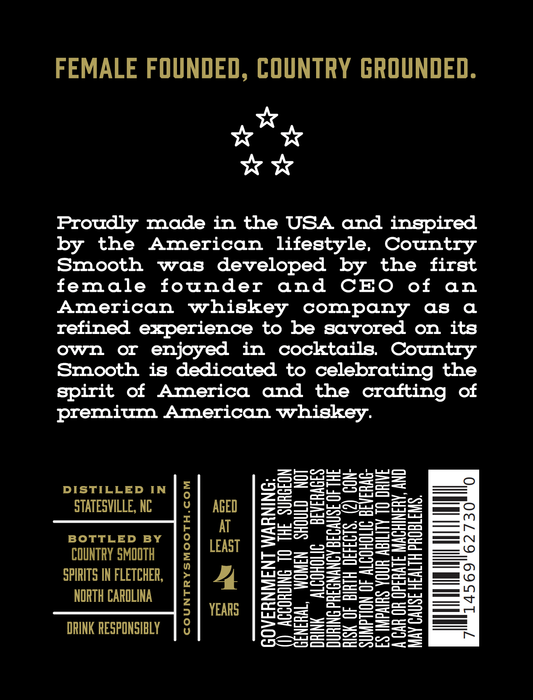
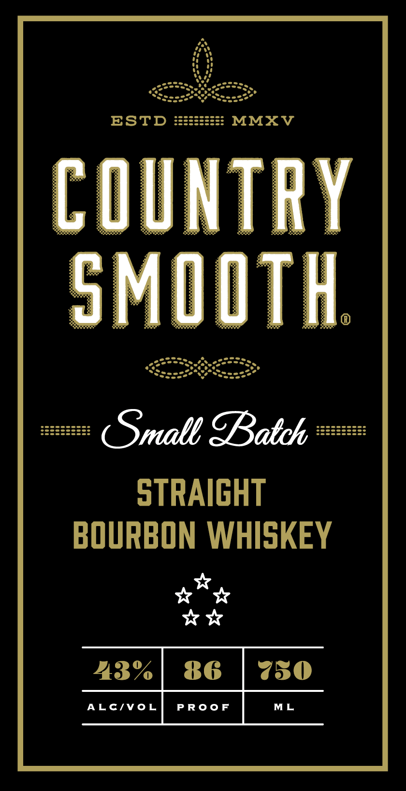

# TTB COLA Label Images - TTBID 26127001000689

**Brand Name:** COUNTRY SMOOTH

**Issue Date:** 05/13/2026

**Origin Code:** 35

**Product Class/Type:** 101

**Source:** [TTB Public COLA Registry](https://ttbonline.gov/colasonline/viewColaDetails.do?action=publicFormDisplay&ttbid=26127001000689)

## Label Images

### Back Label

### Front Label

## Extracted Label Text

*Text extracted via OCR - may contain errors*

### Back Label

FEMALE FOUNDED, COUNTRY GROUNDED.

oe

ww

Proudly made in the USA and inspired
by the American lifestyle, Country
Smooth was developed by the first
female founder and CEO of an
American whiskey company as a
refined experience to be savored on its
own or enjoyed in cocktails. Country
Smooth is dedicated to celebrating the
spirit of America and the crafting of
premium American whiskey.

CON
ERAG-
0

ES IMPAIRS YOUR ABILITY TO DRIVE

DISTILLED IN

STATESVILLE, NC

BOTTLED BY

COUNTRY SMOOTH
SPIRITS IN FLETCHER,
NORTH CAROLINA

DRINK RESPONSIBLY

ACCORDING TO THE SURGEON
NERAL, WOMEN SHOULD NOT

oO
~
~
N
i<e)
oO
Xe)
Fe)
+
ct
~

DRINK ALCOHOLIC BEVERAGES
DURING PREGNANCY BECAUSE OF THE

A CAR OR OPERATE MACHINERY, AND

OVERNMENT WARNING:
MAY CAUSE HEALTH PROBLEMS.

### Front Label

ESTD
MMXV
Ntry
SME
TH
Small IBatch
STRAIGHT
BOURBON WHISKEY
23%
86
750
ALC/VoL
PRoo
ML
