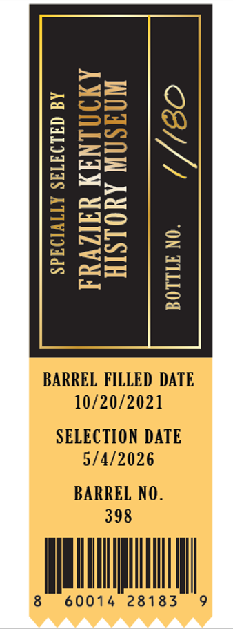
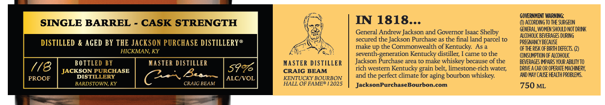
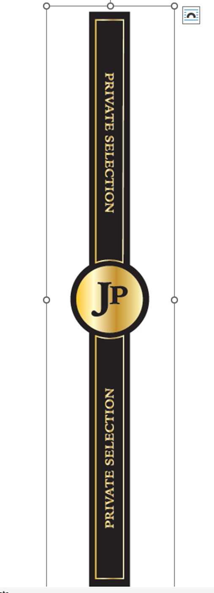

# TTB COLA Label Images - TTBID 26127001000754

**Brand Name:** JACKSON PURCHASE

**Issue Date:** 05/13/2026

**Origin Code:** 22

**Product Class/Type:** 101

**Source:** [TTB Public COLA Registry](https://ttbonline.gov/colasonline/viewColaDetails.do?action=publicFormDisplay&ttbid=26127001000754)

## Label Images

### Back Label

### Label 1

### Label 2

### Label 4

## Extracted Label Text

*Text extracted via OCR - may contain errors*

*1 image(s) excluded: text did not meet readability threshold*

### Back Label

6
8
1
B
W
2
1
BARREL FILLED DATE
10/20/2021
SELECTION DATE
5/4/2026
BARREL NO .
398
60014
28183

### Label 1

GOVERNHEM WARNNG:"
SINGLE BARREL
CASK STRENGTH
IN 1818...
() ACcoRDIng To THE SURGEON
General Andrew Jackson and Governor Isaac Shelby
GEHERAL, WOMEN SHOULD Not DRINK
ALCoHoLIc BEVERAGES DURING
DISTILLED & AGED BY THE JACKSON PURCHASE DISTILLERY@
secured the Jackson Purchase as the
land parcel to
PREGMANCY BECHUSE
make up the Commonwealth of Kentucky:
Asa
OFTHE RISK OF BIRTH deFECTS Q)
HICKMAN, KY
seventh-
~generation Kentucky distiller;
came t0 the
CONSUMIPTION OF hLcohouc
BOTTLED BY
MASTER DISTILLER
MASTER DISTILLER
Jackson Purchase area t0 make whiskey because of the
BEVERHGES IMPHIRS YOUR ABILTY TO
(/8
JACKSON PURCHASE
599
CRAIG BEAM
rich western Kentucky
belt; limestone-rich water;
DRIVEA CAR OR OFERATE M4CHINERY,
PROOF
DISTILLERY
Bes
ALCNVOL
KENTUCKY BOURBON
and the
perfect climate for aging bourbon
AND MAY € alke health PROBLEMS.
BARDSTOWN, KY
CRAIG BEAM
HALL OF FAMER |2025
JacksonPurchaseBourbon-com
750 ML
final
grain
whiskey:

### Label 2

PURCHASE
KENTUCKY STRAIGHT BOURBON WHISKEY
JACKSON
