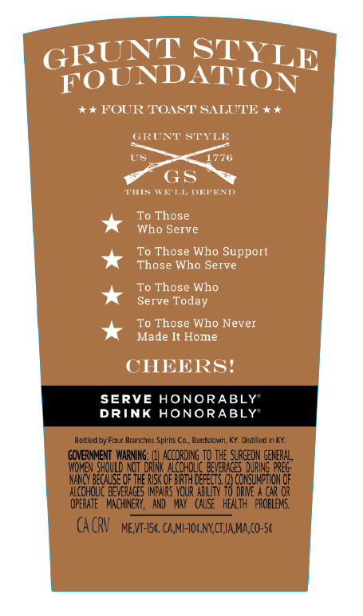
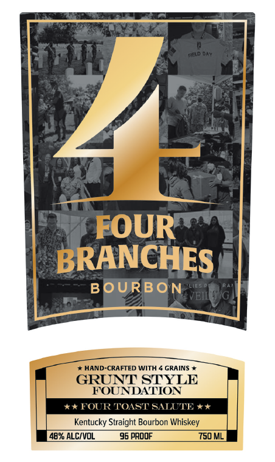
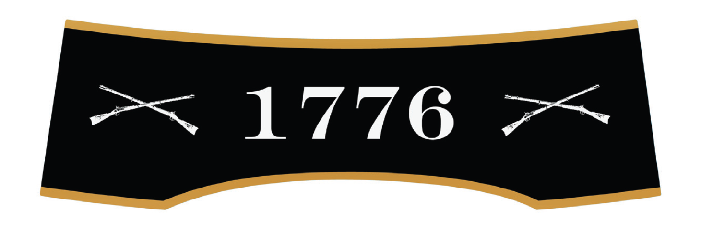
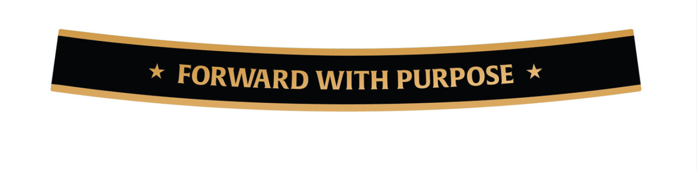

# TTB COLA Label Images - TTBID 26127001000763

**Brand Name:** FOUR BRANCHES

**Issue Date:** 05/13/2026

**Origin Code:** 22

**Product Class/Type:** 101

**Source:** [TTB Public COLA Registry](https://ttbonline.gov/colasonline/viewColaDetails.do?action=publicFormDisplay&ttbid=26127001000763)

## Label Images

### Back Label

### Label 1

### Label 3

### Label 4

## Extracted Label Text

*Text extracted via OCR - may contain errors*

*2 image(s) excluded: text did not meet readability threshold*

**Detected Proof:** 96

### Back Label

STYLE
FOUND
*+ FOUR TOAST SALUTE + *
GRCNT STYLE
US
1776
GS
FC
MK'L.I:
De
To Those
Who Serve
To
Who
Support
Those Who Serve
To Those Who
Serve Today
To Those Who Never
Made It Home
CHEERSI
SERVE HONORABLY
DRINK HONORABLY
Bolled [
ccur Branches
Spirits Co. Bardstcwin, KY. Disliled in KX:
GOVERNMENT  WarMNg:
ACCoRding TO the SURCEON
EEE
Wowen ShoulD 42T oRILkAcohoug DeVEF4ces DuRNNG
NANCY BECALSE OF THE RISk OF BIRTH deFECTS
TCokunejOM oe
Acohqluc deverages IpaRS Vour
DRME
opERATE ` Vach NeRY,  AND ^ May  calse ^ hEalth
ROHEd"
cA CRV
MEVT-IS4 CAMF-JOGNYCTIA MA,co-54
GRUNT
ATION
Those
8

### Label 1

Deld 04s
1
FOUR
BRANCHES
BOURBON
VEIl
HAND-CRAFTED WITH
GRAINS
GRUNT STYLE
FOUNDATION
4*FOURTOAST SALUTE + +
Kentucky Straight Bourbon Whiskey
482 ALCIVOL
96 PROOF
750 ML
