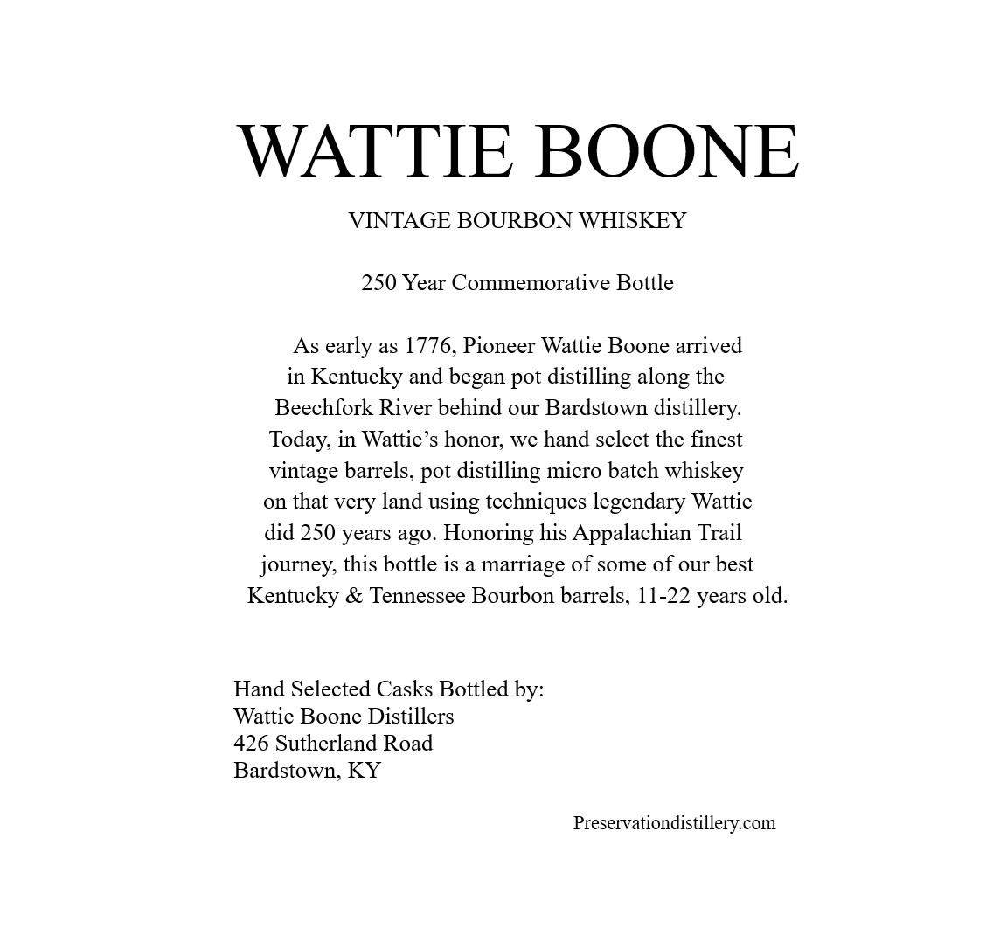
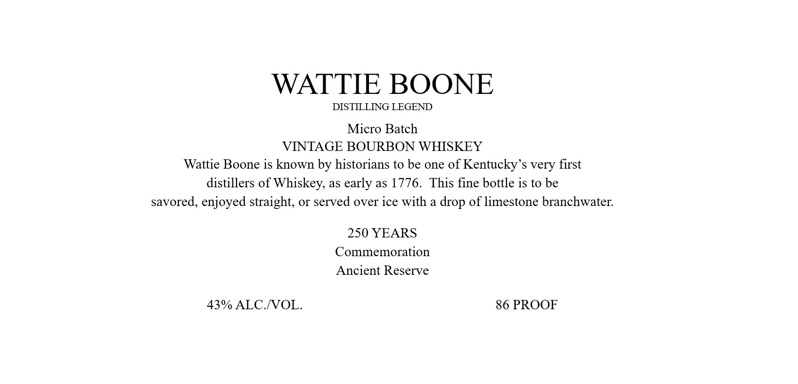
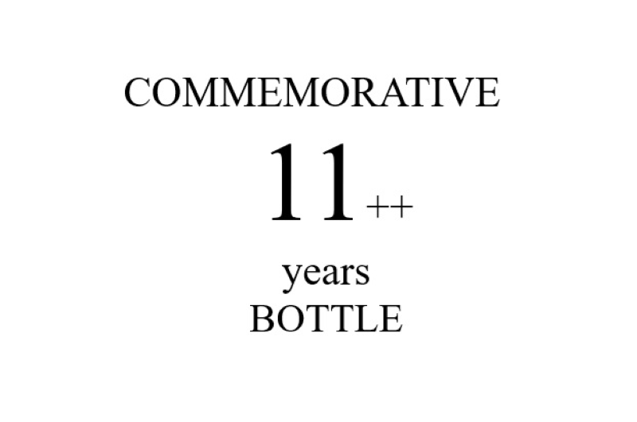
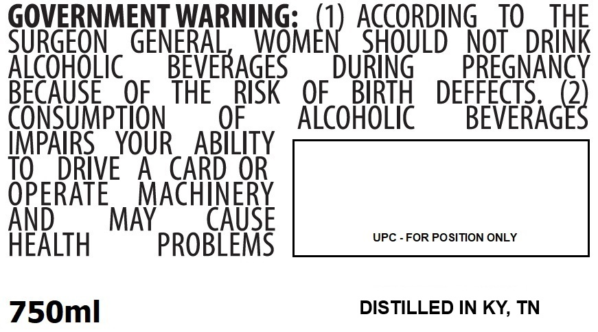

# TTB COLA Label Images - TTBID 26127001000861

**Brand Name:** WATTIE BOONE

**Issue Date:** 05/13/2026

**Origin Code:** 22

**Product Class/Type:** 141

**Source:** [TTB Public COLA Registry](https://ttbonline.gov/colasonline/viewColaDetails.do?action=publicFormDisplay&ttbid=26127001000861)

## Label Images

### Back Label

### Label 1

### Label 3

### Label 4

### Label 5

## Extracted Label Text

*Text extracted via OCR - may contain errors*

*2 image(s) excluded: text did not meet readability threshold*

**Detected Proof:** 86
**Detected Age:** 22 Years

### Back Label

WATTIE BOONE
VINTAGE BOURBON WHISKEY
250 Year Commemorative Bottle
As early as 1776, Pioneer Wattie Boone arrived
in Kentucky and
pot distilling along the
Beechfork River behind our Bardstown distillery:
in Wattie s honor; we hand select the finest
vintage barrels, pot distilling micro batch whiskey
on that very land
using techniques legendary Wattie
did 250 years ago. Honoring his Appalachian Trail
journey; this bottle is a
marriage of some of our best
Kentucky & Tennessee Bourbon barrels, 11-22 years old.
Hand Selected Casks Bottled by:
Wattie Boone Distillers
426 Sutherland Road
Bardstown; KY
Preservationdistillerycom
began
Today;

### Label 1

WATTIE BOONE
DISTILLING LEGEND
Micro Batch
VINTAGE BOURBON WHISKEY
Wattie Boone is known by historians to be one of Kentucky'$ very first
distillers of Whiskey, as early as 1776.
This fine bottle is to be
savored, enjoyed straight, O served over ice with a drop of limestone branchwater:
250 YEARS
Commemoration
Ancient Reserve
43% ALC NOL.
86 PROOF

### Label 4

GOVERNMENT WARNING:
ACCORDING
TO
THE
SURGEON
GENERAL,
WNGmer) ,
SHOULD
NOT
DRINK
AicoHoLic
BEVERAGES
DURiNG
PREGNANCY
BECAUSE
OF
THE
RISK
OF
BIRTH
DEFFECTS
2
CONSUMpTION
OF
Alcohoic
BEVERAGES
IMPAIRS
YOUR
ABILITY
TO
DRIVE
A
CARD OR
OPERATE
MACHINERY
And
MAY
CAUSE
UPC - FOR POSITION ONLY
HEALTH
PROBLEMS
750ml
DISTILLED IN KY, TN
