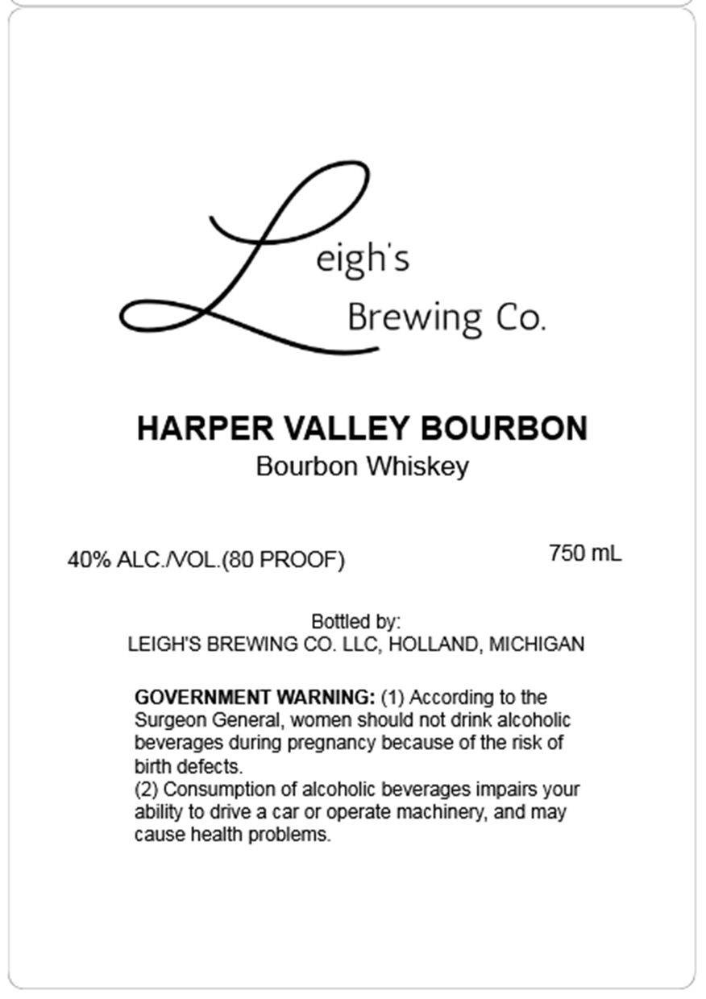

# TTB COLA Label Images - TTBID 26128001000143

**Brand Name:** LEIGH'S BREWING CO.

**Fanciful Name:** HARPER VALLEY BOURBON

**Issue Date:** 05/13/2026

**Origin Code:** 06

**Product Class/Type:** 141

**Source:** [TTB Public COLA Registry](https://ttbonline.gov/colasonline/viewColaDetails.do?action=publicFormDisplay&ttbid=26128001000143)

## Label Images

### Label 1

## Extracted Label Text

*Text extracted via OCR - may contain errors*

**Detected Proof:** 80

### Label 1

eigh's
Brewing Co.
HARPER VALLEY BOURBON
Bourbon Whiskey
40% ALC NOL.(80 PROOF)
750 mL
Bottled by:
LEIGHS BREWING CO. LLC, HOLLAND, MICHIGAN
GOVERNMENT WARNING: (1) According to the
Surgeon General
women should not drink alcoholic
beverages during pregnancy because of the risk of
birth defects_
(2) Consumption of alcoholic beverages impairs your
ability to drive a car or operate machinery, and may
cause health problems
