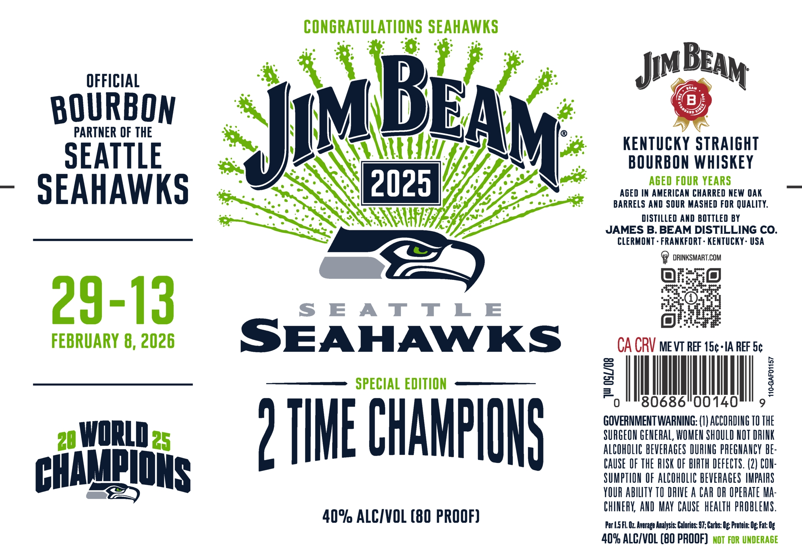

# TTB COLA Label Images - TTBID 26128001000144

**Brand Name:** JIM BEAM

**Issue Date:** 05/13/2026

**Origin Code:** 22

**Product Class/Type:** 101

**Source:** [TTB Public COLA Registry](https://ttbonline.gov/colasonline/viewColaDetails.do?action=publicFormDisplay&ttbid=26128001000144)

## Label Images

### Label 1

### Label 2

## Extracted Label Text

*Text extracted via OCR - may contain errors*

**Detected Proof:** 80

### Label 1

CONGRATULATIONS SEAHAWKS
OFFICIAL
Jim
B
BOURBOM
PARTNER OF THE
JBEAM
KenTuCKY STRAIGHT
SEATTLE
BOURBON WHISKEY
SEAHAWKS
2025
Aged In AHERICAN CHARRED WEW OAK
BARRELS AND SOUR MASHED FOR QUALITY:
DISTILLED AND BOTTLED BY
JAMES B. BEAM DISTILLING CO.
CLERMONT - FRANKFORT - KENTUCKY - USA
DRINKSMART.COM
29-13
S E A T Tl E
FEBRUARY 8, 2026
SEAHAWKS
CA CRV mevT REF 15c-IA REF 5c
SPECIAL EDITION
2
1
F
0
80686"00140
GOVERNMENT WARNING: (I) ACCOPDING TO THE
2eWQRLDes
2 IHHE CHHHPIOHS
SURGEON GENERAL, WOMEN SHOULD NOT DRINK
ALCOhOLIC BEVERAGES DURING PREGHANCY be:
CAuse  OF THE RUSK OF bIRTH DEFECTS. (2) CIN:
CHATP@NS
SUMPTION OF AlCOhOLIC bEVERAGeS MPAIPS
YOUR AbILTy TO DRIVE A CA OR OPERATE Ma:
ChINERK AND  MAY  CAUSE   heALTh pRObLEMS .
40% ALCIVOL (80 PROOF)
Per |.5FL Oz Average Analysis: Calories: 97; Carbs: Ug; Protein: Og Fat: Og
409 ALCIVOL (B0 PROOF]   nOT FoR UNDERAGE
BEAM

### Label 2

The
JAMESBBEAM
JAMESBBEAM
DISTILLING CO:
DISTILLING CO:
Goustyieso _
Garnea Raear
O6l8
)
