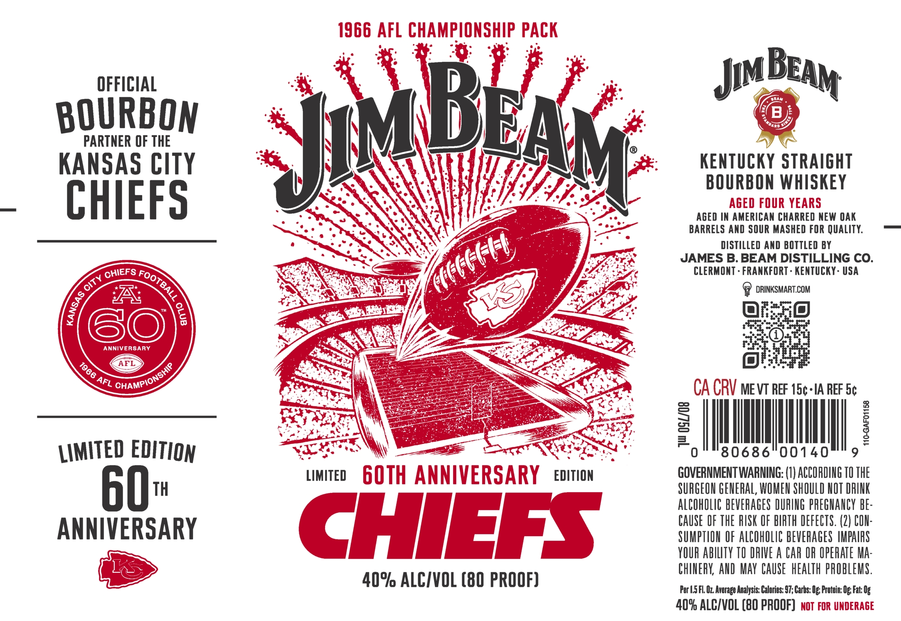

# TTB COLA Label Images - TTBID 26128001000145

**Brand Name:** JIM BEAM

**Issue Date:** 05/13/2026

**Origin Code:** 22

**Product Class/Type:** 101

**Source:** [TTB Public COLA Registry](https://ttbonline.gov/colasonline/viewColaDetails.do?action=publicFormDisplay&ttbid=26128001000145)

## Label Images

### Label 1

### Label 2

## Extracted Label Text

*Text extracted via OCR - may contain errors*

**Detected Proof:** 80

### Label 1

1966 AFL CHAMPIONSHIP PACK
OFFICIAL
Jim
BOURBON
B
PARTNER OF THE
KANSAS CITY
KenTuCKY STRAIGHT
BOURBON WHISKEY
CHIEFS
AGED FOUR YEARS
AGED IN AMERICAN CHARRED NEW OAK
BARRELS AND SOUR MASHED FOR QUALITY:
DISTILLED AND BOTTLED BY
JAMES B. BEAM DISTILLING CO.
CLERMONT . FRANKFORT . KENTUCKY - USA
DRINKSMART.COM
A
S0
ANNIVERSARY
AFL
CA CRV me vT REF 15c-IA REF 5c
2
1
F
LIMITED EDITION
0
80686
00140
LIMITED
60TH ANNIVERSARY
EDITION
GOVERNMENT WARNING: (I) ACCORDING TO THE
60
TH
SURGEON GENERAL, WOMEN SHOULD NOT DRINK
ALCOhOLIC BEVERAGES DURING PREGNANCY bE:
ANNIVERSARY
CHAS
CAuse OF THE RUSK OF BIRTH DEFECTS. (2) CON:
SUMPTION OF AlCOhOLIC bEVERAGeS HMPAIPS
YOUR abilTY TO DRIVE A CAR OR OpehATe Ma:
ChINERK AND MAY  CAUSE   heALTH pRObLEMS .
40% ALCIVOL (80 PROOF)
Per |.5FL Oz Average Analysis: Calories: 97; Carbs: Ug; Protein: Og Fat: Og
409 ALCIVOL (BQ PROOF)  not For UNDERAGE
BEAM
BEAM
Ykii
(G6Ui
CHIEFS
FOOTBALL =
CiTy
1
8
1966
ChAMPiONSHIR
AFL

### Label 2

The
JAMESBBEAM
JAMESBBEAM
DISTILLING CO:
DISTILLING CO:
Goustyieso _
Garnea Raear
O6l8
)
