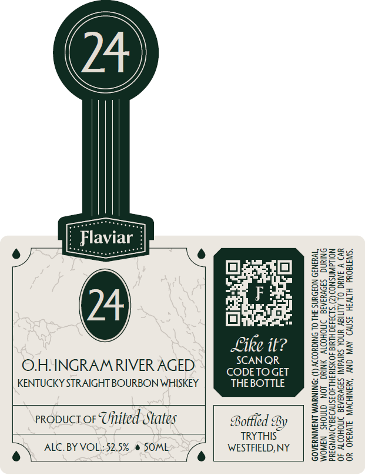

# TTB COLA Label Images - TTBID 26128001000212

**Brand Name:** FLAVIAR

**Issue Date:** 05/19/2026

**Origin Code:** 02

**Product Class/Type:** 101

**Source:** [TTB Public COLA Registry](https://ttbonline.gov/colasonline/viewColaDetails.do?action=publicFormDisplay&ttbid=26128001000212)

## Label Images

### Front Label

## Extracted Label Text

*Text extracted via OCR - may contain errors*

**Detected Proof:** 105

### Front Label

O.H. INGRAM RIVER AGED
KENTUCKY STRAIGHT BOURBON WHISKEY

Like it?
SCAN QR
CODE TO GET
THE BOTTLE

probuct or Uitited States

ALC. BY VOL.: 52.5% @ SOME
e) e

Bottied By
TRYTHIS
WESTFIELD, NY

OR OPERATE MACHINERY, AND MAY CAUSE HEALTH PROBLEMS.

GOVERNMENT WARNIN
WOMEN SHOULD. NOT
