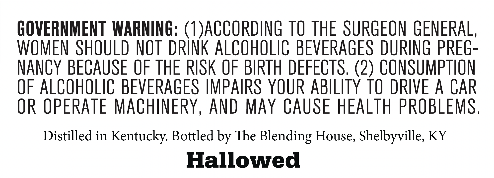
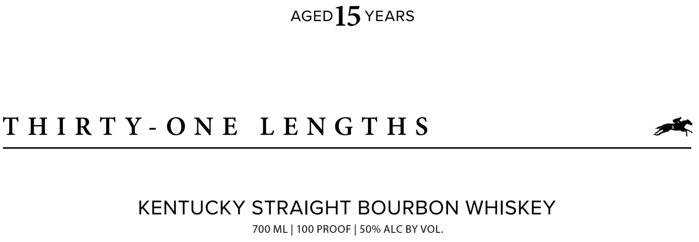

# TTB COLA Label Images - TTBID 26128001000434

**Brand Name:** THIRTY-ONE LENGTHS

**Issue Date:** 05/13/2026

**Origin Code:** 22

**Product Class/Type:** 101

**Source:** [TTB Public COLA Registry](https://ttbonline.gov/colasonline/viewColaDetails.do?action=publicFormDisplay&ttbid=26128001000434)

## Label Images

### Back Label

### Front Label

### Label 3

### Label 4

### Label 5

## Extracted Label Text

*Text extracted via OCR - may contain errors*

*3 image(s) excluded: text did not meet readability threshold*

**Detected Proof:** 100
**Detected Age:** 5 Years

### Back Label

GOVERNMENT WARNING: (1)ACCORDING TO THE SURGEON GENERAL

WOMEN SHOULD NOT DRINK ALCOHOLIC BEVERAGES DURING PREG-

NANCY BECAUSE OF THE RISK OF BIRTH DEFECTS. (2) CONSUMPTION

OF ALCOHOLIC BEVERAGES IMPAIRS YOUR ABILITY TO DRIVE A CAR

OR OPERATE MACHINERY, AND MAY CAUSE HEALTH PROBLEMS

Distilled in Kentucky. Bottled by The Blending House, Shelbyville, KY

Hallowed

### Front Label

AGED ]5 YEARS

THIRTY-ONE LENGTHS

KENTUCKY STRAIGHT BOURBON WHISKEY

700 ML | 100 PROOF | 50% ALC BY VOL.
