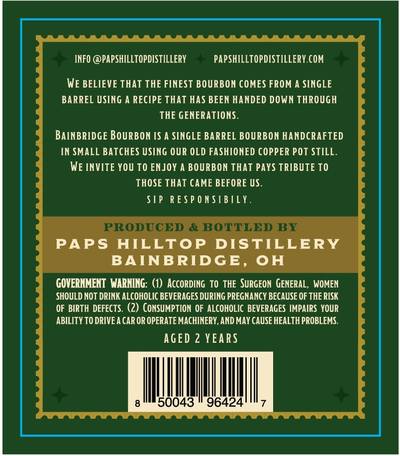
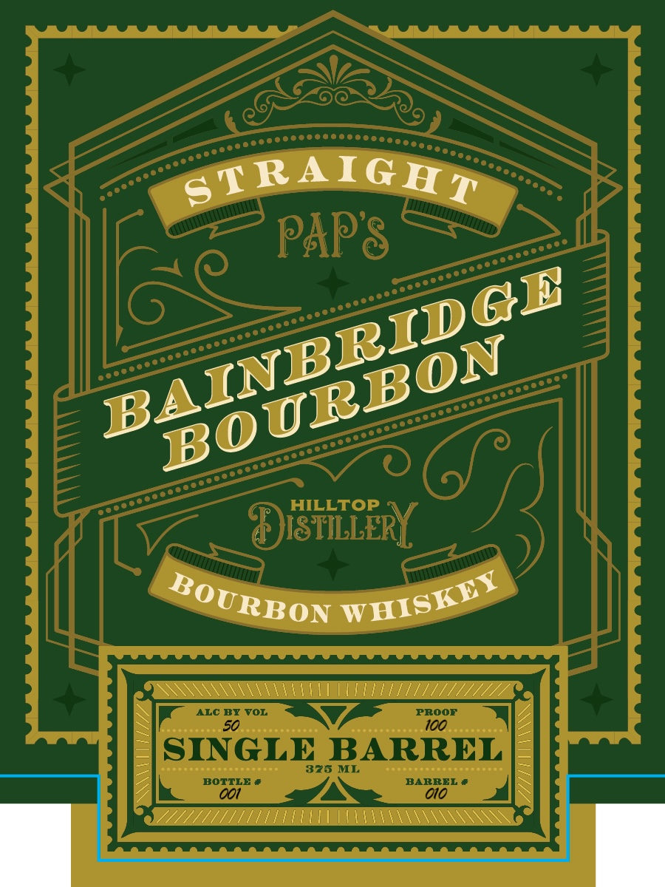

# TTB COLA Label Images - TTBID 26128001000462

**Brand Name:** BAINBRIDGE BOURBON

**Issue Date:** 05/14/2026

**Origin Code:** 09

**Product Class/Type:** 141

**Source:** [TTB Public COLA Registry](https://ttbonline.gov/colasonline/viewColaDetails.do?action=publicFormDisplay&ttbid=26128001000462)

## Label Images

### Back Label

### Front Label

## Extracted Label Text

*Text extracted via OCR - may contain errors*

**Detected Proof:** 100
**Detected Age:** 2 Years

### Back Label

INFO @PAPSHILLTOpDISTiLLeRY
PAPSHILLTOPDISTILLERY COM
WE BELIEVE ThAT THE FINEST BOURBON COMES FROM A SINGLE
BARREL USING A RECIPE THAT HAS BEEN HANDED DOWN THROUGH
THE GENERATIONS .
BAINBRIDGE BOURBON IS A SINGE BARREL BOURBON HANDCRAFTED
IN SMALL BATCHES Using OUR OLD FASHIONED COPPER POT STILL.
WE INVITE YOU TO ENJOY A BOURBON THAT PAys TRIBUTE TO
THOSE THAT CAME BEFORE US.
STP RESP 0 N $IBTLY .
PRODUCED
& BOTTLED BY
PAPS
HILLTOP
DISTILLERY
BAINBRIDGE.
OH
GOVERNMENT WARNING: (1) AccORdIng TO THE SurgEON  GENERAL
WOMEN
SHOULD NOT DRINK ALCOHOLIC BEVERAGES DURING PREGNANCY BECAUSE OF THE RISK
OF BIRTH  DEFECTS.  (2) CONSUMPTION OF ALCOHOLIC  BEVERAGES IMPAIRS YOUR
ABILITY TO DRIVEA CAR OR OPERATE MACHINERY,AND MAY CAUSE HEALTH PROBLEMS.
AGED 2 YEARS
50043
96424

### Front Label

STRAIGHT
PAP8
HILLTOP
ISTILLERY
ALC BY
VOL
PROOF
50
100
SINGLE BARREL
375 ML
BOTTLE
BARREL
001
010
BAINBRIDCB
BOURBON
WHISKEY
BOURBON
