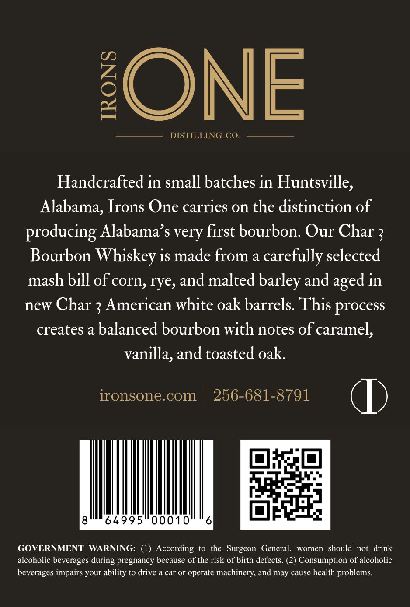
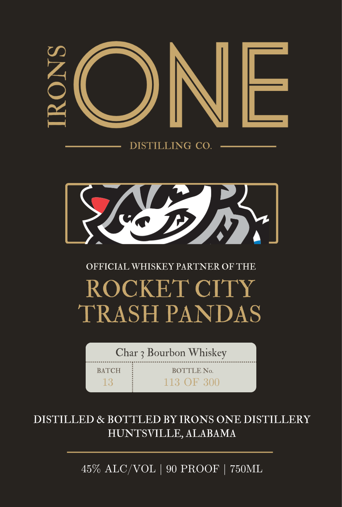

# TTB COLA Label Images - TTBID 26128001000498

**Brand Name:** IRONS ONE DISTILLERY

**Issue Date:** 05/13/2026

**Origin Code:** 10

**Product Class/Type:** 101

**Source:** [TTB Public COLA Registry](https://ttbonline.gov/colasonline/viewColaDetails.do?action=publicFormDisplay&ttbid=26128001000498)

## Label Images

### Back Label

### Label 1

## Extracted Label Text

*Text extracted via OCR - may contain errors*

**Detected Proof:** 90

### Back Label

{ONE
DISTILLING CO
Handcrafted in small batches in Huntsville,
Alabama, Irons One carries on the distinction of
producing Alabama' s very first bourbon: Our Char 3
Bourbon Whiskey is made from a carefully selected
mash bill of corn, rye, and malted barley and
in
new Char 3 American white oak barrels. This process
creates a balanced bourbon with notes of caramel,
vanilla, and toasted oak:
ironsone com
256-681-8791
64995"00010
6
GOVERNMENT
WARNING: (1) According
to the
Surgeon   General,
women   should not  drink
alcoholic beverages during pregnancy because of the risk of birth defects. (2) Consumption of alcoholic
beverages impairs your ability to drive a car Or operate machinery; and
cause health
problems
aged
may

### Label 1

ONE

DISTILLING CO.

~

PD.

OFFICIAL WHISKEY PARTNER OF THE

ROCKET CITY

TRASH PANDAS

yurbon

key

BATCH

BOTT N

DISTILLED & BOTTLED BY IRONS ONE DISTILLERY

HUNTSVILLE, ALABAMA

45% ALC/VOL | 90 PROOF | 750ML
