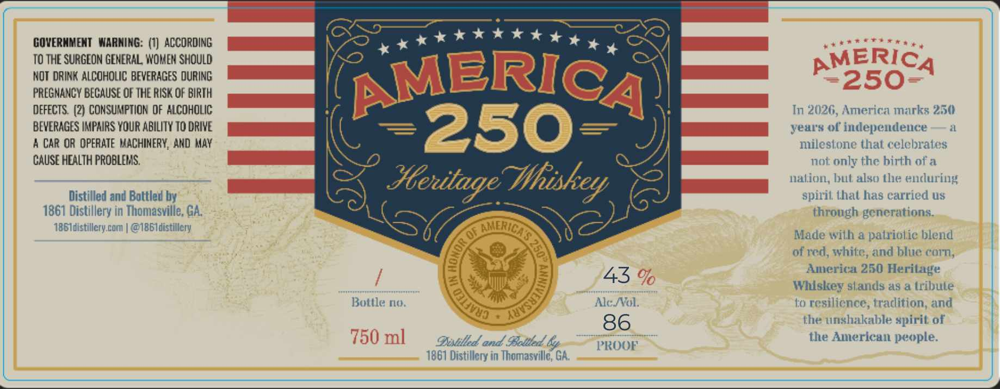
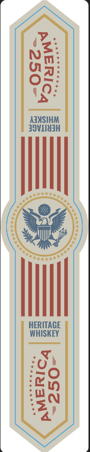

# TTB COLA Label Images - TTBID 26128001000541

**Brand Name:** 1861 DISTILLERY

**Fanciful Name:** AMERICA 250 HERITAGE WHISKEY

**Issue Date:** 05/29/2026

**Origin Code:** 08

**Product Class/Type:** 140

**Source:** [TTB Public COLA Registry](https://ttbonline.gov/colasonline/viewColaDetails.do?action=publicFormDisplay&ttbid=26128001000541)

## Label Images

### Label 1

### Label 2

## Extracted Label Text

*Text extracted via OCR - may contain errors*

### Label 1

(RD

SAD

GOVERMMENT WARNING: (7) ACCORDING

KKK HEY,

TO THE SURGEON GENERAL WOMEN SHOULD

Ven eae

NOT DRINK ALCOHOLIC BEVERAGES DURING

PREGNANCY BECAUSE OF THE RISK OF BIRTH

ERIC

a

In 2026, America marks 250

DEFECTS. (2) CONSUMPTION OF ALCOHOLIC

‘pa

BEVERAGES IMPAIRS YOUR ABILITY 10 DRIVE

years of independence

1

A CAR OR OPERATE MACHINERY, AND MAY

A

milestone that celebrates

=250-

CAUSE HEALTH PROBLEMS.

not only the birth of a

ae

nation, but also the enduring

spirit. that has carried us

Distilled and Bottled by

7

Ste lage Whiskey

e

1861 Distillery in Thomasville, GA

through generations.

86 ldistillery.com | @1861 distillery

Made with a patriotic blend

S77

wer

of red, white

nd blue carn

America 250 Heritage

43

Whiskey stands as a tribute

Bottle no

Ale /Vol

o resilience, tradition, and

he

inshakable spirit of

86

Distilled and Belllea

ROOK

the American people

1861 Distillery in Thomasville, GA.

### Label 2

y.
ie
Nai
Oy:
OG:
Y’
AJMSIHM
FOVLINIH
Rea
i Saxe ):
\ yd /:
ON fe)
HERITAGE
WHISKEY
id
1 e)
Mig
gn
wal
