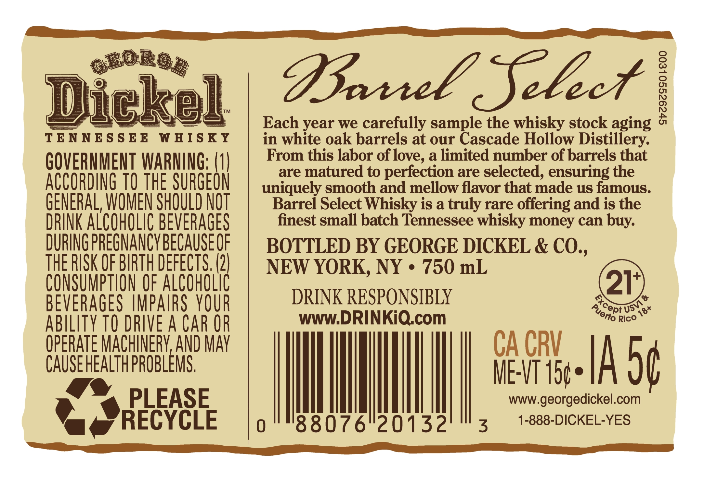
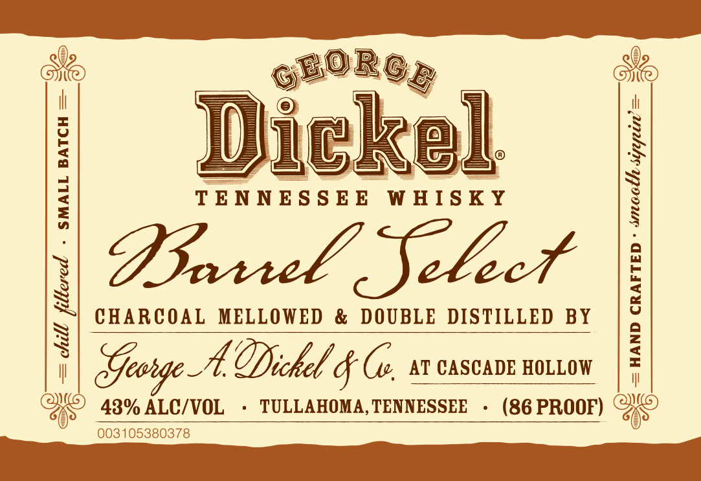
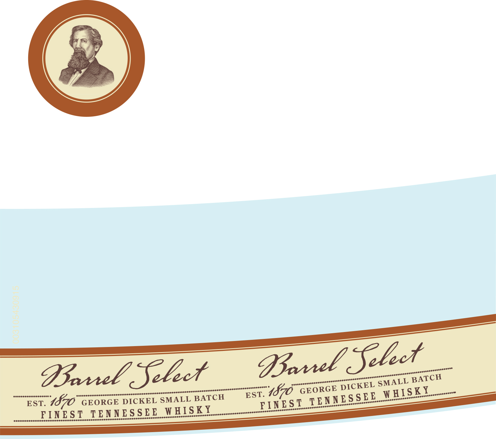

# TTB COLA Label Images - TTBID 26128001000654

**Brand Name:** GEORGE DICKEL

**Fanciful Name:** BARREL SELECT

**Issue Date:** 05/15/2026

**Origin Code:** 04

**Product Class/Type:** 140

**Source:** [TTB Public COLA Registry](https://ttbonline.gov/colasonline/viewColaDetails.do?action=publicFormDisplay&ttbid=26128001000654)

## Label Images

### Back Label

### Label 1

### Label 3

## Extracted Label Text

*Text extracted via OCR - may contain errors*

**Detected Proof:** 86

### Back Label

GBoRod
Dickel
DLSeLctl
Each year we carefully
oaneleschde
the whisky stock aging
TENN ES $ EE
W HISKY
in white oak barrels at our
Hollow Distiliery:
GOVERNMENT WARNING; (U|
From this labor of love, a limited number of barrels that
are matured to
perfection are selected, ensuring the
ACCORDING TO THE SURGEON
uniquely smooth and mellow flavor that made us famous:
GENERAL, WOMEN SHOULD NOT
Barrel Select Whisky is a truly rare offering and is the
DRINK ALCOHOLIC BEVERAges
finest small batch Tennessee whisky money can
DURING PREGNANCYBECAUSE OF
BOTTLED BY GEORGE DICKEL & CO.,
THE RISK OF BIRTH DEFECTS (2)
NEW YORK, NY
750 mL
CONSUMPTHON OF ALCOHOLIC
21
BEVERAGES IMPAIRS YOUR
DRINK RESPONSIBLY
0
ABILITY TO DRIVE A CAr OR
WWW.DRINKiQcom
Rico
OPERATE MACHINERV AND MAy
CA CRV
CAUSE HEALTH PROBLEMS,
ME-VT 150=
Ia 5c
PLEASE
wWWgeorgedickel.com
RECYCLE
"88076"20132
3
1-888-DICKEL-YES
buy:
Except _
USVI
Puerto
18+

### Label 1

De
@

- SMALL BATCH = =<

NES SEE. WHISKY

Baril Select

CHARCOAL MELLOWED & DOUBLE DISTILLED BY

Qe

i

chill filtered

YQ 438% ALC/VOL

N George A. Dickel g (¢, av CASCADE HOLLOW

+ TULLAHOMA, TENNESSEE

HAND CRAFTED - sooth sizpein’

II

+ (86 PROOF) “Zi

003105380378

### Label 3

elect

ooo

essonsnsenoeseeee!

sennsonsooneeeee"

escosssssnoneseee"

Barrel Select

eoseneceees

senscssscnsnsnsnonenonnneneeet

CKEL SMA

LLB

ATCH

seceescescceoeseoees

ceucsebaspescsncsusesveatrocscroscerotpavecssesntecenseeeetweetstre

jessecssnscnoosoeees

CH

EST

1570

GEORGE DI

Isk

rensenseee’

heveossconetee

EST. Z

70 GE

ORGE DICKEL SMALL

aoncnnneee’

TENNES

jennseeeee!

yenneees

sosseenset

SEE

mrosnonsencceeere’

enwcneseeee’

FIN

ENNESSEE WHI

yeseescensensoeees

seeaeeeeneeent

SKY

 cenresscecssonsconssssswoneeesenees

sceeeseccnccessenssecsesenssneoneensvosssoonsese:

jaeeeseecensosneese’
