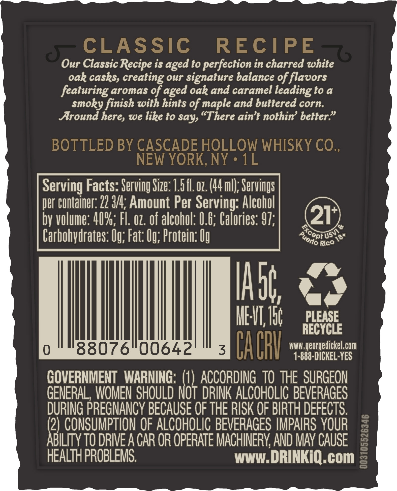
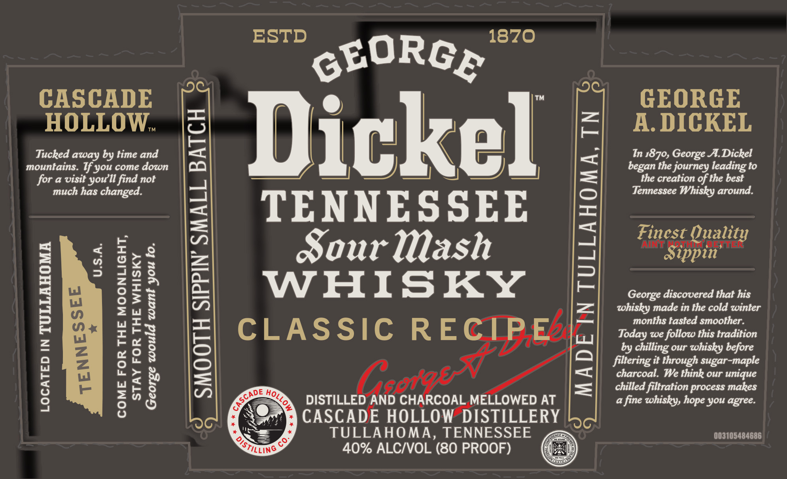
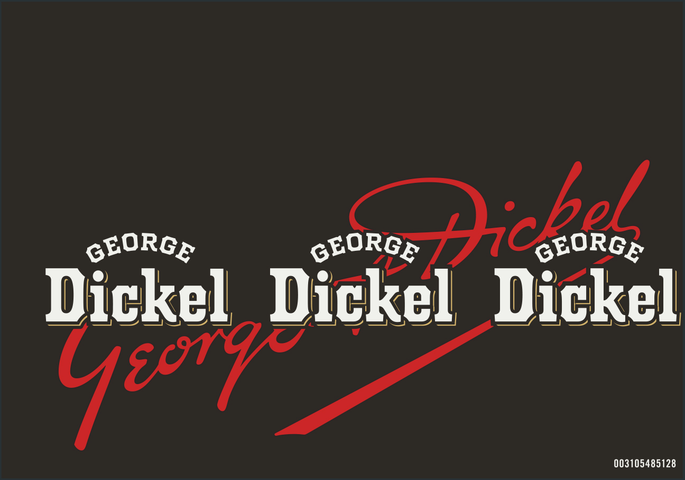

# TTB COLA Label Images - TTBID 26128001000661

**Brand Name:** GEORGE DICKEL

**Fanciful Name:** CLASSIC RECIPE

**Issue Date:** 05/15/2026

**Origin Code:** 04

**Product Class/Type:** 140

**Source:** [TTB Public COLA Registry](https://ttbonline.gov/colasonline/viewColaDetails.do?action=publicFormDisplay&ttbid=26128001000661)

## Label Images

### Back Label

### Label 1

### Label 3

## Extracted Label Text

*Text extracted via OCR - may contain errors*

**Detected Proof:** 80

### Back Label

~ )
CLASSIC
RECIPE
Our Classic Recipe is aged to perfection in charred white
oak casks, creating our signature balance of flavors
featuring aromas of aged oak and caramel leadingto a
Smoky finish with hints of maple and buttered corn.
Around here, We like to say, "There aint nothin' better"
BOTTLED BY CASCADE HOLLOW WHISKY CO.
NEW YORK, NY
1L
Serving Facts: Serving Size: 7 5 fl.0z. (44mll; Servings
per Container: 22 3/4; Amount Per Serving: Alcohol
by volume: 40%; FL  oz . of alcohol: 0.6, Calories: 97;
21
0
Carbohydrates: Ug; Fat: Ug; Protein: Ug
Rico
IAbg
IEVT; I5
PLEASE
RECYCLE
0
88076"00642
3
Cabh
WWW ;
georgedickel.com
1-888-DICKEL-YES
GOVERNMENT  WARNING: (1) ACCORDING  TO ThE  SURGEON
GENERAL, WOMEN SHOULD NoT DRINK ALCOHOLIC BEVERAGES
DURING PREGNANCY BECAUSE OF THE RISK OF BIRTH DEFECTS.
(2) CONSUMPTION OF ALCOHOLIC BEVERAGES IMPAIRS YOUR
ABILITY TO DRIVE A CAR OR OPERATE MACHINERV AND MAV CAUSE
1
HEALTH PROBLEMS.
WWW_I
DRINKiQ.com
excep _
'UsVI
Puerto
18+

### Label 1

ESTD

1870

gtORGe

CASCADE

GEORGE

HOLLOW.

A. DIGKEL

Tucked away by time and

In 1870, George A. Dickel

mountains. If you come down

for a visit you'll find not

_}

el

began the journey leading to

the creation of the best

much has changed.

Tennessee Whisky around.

TENNESSEE

Fines

C

"Si

ppin

Quality

on.

+ ”79

=—=<3

Sour Mash

z=

ots

oF=§

WHISKY

George discovered that his

zuwg

whisky made in the cold winter

months tasted smoother.

Ce

w =

eas

Today we follow this tradition

by chilling our whisky before

fo} wu

zo

CLASSIC RECIPE.

filtering it through sugar-maple

charcoal. We think our unique

=n

u = &

eo

chilled filtration process makes

DISTILLED‘AND CHARC

OAL MELLOWED AT

a fine whisky, hope you agree.

CASCADE HOLLO

W DISTILLERY

ae

TULLAHOMA, TENNESSEE

003105484686

40% ALC/VOL (80 PROOF)

### Label 3

GEORGE
GEORGE
Pricatonog _
Dickel   Dickel
Dickel
003105485128
48{
