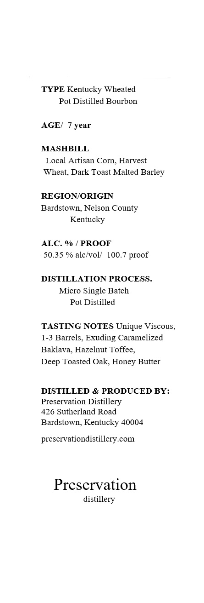

# TTB COLA Label Images - TTBID 26128001000769

**Brand Name:** PRESERVATION ESTATE POT DISTILLED BOURBON WHISKEY

**Issue Date:** 05/15/2026

**Origin Code:** 22

**Product Class/Type:** 141

**Source:** [TTB Public COLA Registry](https://ttbonline.gov/colasonline/viewColaDetails.do?action=publicFormDisplay&ttbid=26128001000769)

## Label Images

### Label 1

### Label 2

### Label 3

### Label 4

## Extracted Label Text

*Text extracted via OCR - may contain errors*

**Detected Proof:** 100.7

### Label 1

TYPE Kentucky Wheated
Pot Distilled Bourbon
AGEI
year
MASHBILL
Local Artisan Corn, Harvest
Wheat; Dark Toast Malted Barley
REGIONORIGIN
Bardstown, Nelson County
Kentucky
ALC. %
PROOF
50.35 % alc voll
100.
DISTILLATION PROCESS
Micro Single Batch
Pot Distilled
TASTING NOTES Unique Viscous_
[-3 Barrels_
Exuding Caramelized
Baklava, Hazelnut Toffee_
Deep Toasted Oak;
Butter
DISTILLED & PRODUCED BY:
Preservation Distillery
426 Sutherland Road
Bardstown; Kentucky 40004
preservationdistillery.com
Preservation
distillery
proof
Honey

### Label 2

PRESERVATION

estate pot distilled

Kentucky Bourbon Whiskey

### Label 3

Barrel Number:

Private Barrel Pick for:

1234

A.B.C. Wine & Spirits

### Label 4

GOVERNMENT WARNING:
ACCORDING
TO
THE
SURGEON
GENERAL
INGmEr) AGOBD8
NOT
DRINK
AicoHoLic
BEVERAGES
DURiNG
PREGNANCY
BECAUSE
OF
THE
RISK
OF
BIRTH
DEFFECTS
2
CONSUMpTION
OF
Alcohoic
BEVERAGES
IMPAIRS
YOUR
ABILITY
TO
DRIVE
A
CAR
OR
OPERATE
MACHINERY
And
MAY
CAUSE
UPC - FOR POSITION ONLY
HeALTH
PROBLEMS:
750ml
