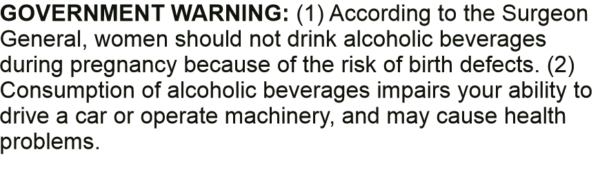
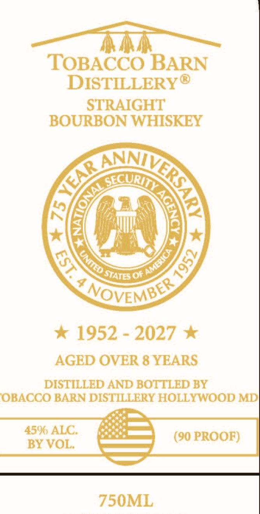

# TTB COLA Label Images - TTBID 26128001000795

**Brand Name:** TOBACCO BARN DISTILLERY

**Issue Date:** 05/14/2026

**Origin Code:** 25

**Product Class/Type:** 101

**Source:** [TTB Public COLA Registry](https://ttbonline.gov/colasonline/viewColaDetails.do?action=publicFormDisplay&ttbid=26128001000795)

## Label Images

### Back Label

### Front Label

## Extracted Label Text

*Text extracted via OCR - may contain errors*

**Detected Proof:** 90
**Detected Age:** 8 Years

### Back Label

GOVERNMENT WARNING: (1) According to the Surgeon

General, women should not drink alcoholic beverages

during pregnancy because of the risk of birth defects. (2)

Consumption of alcoholic beverages impairs your ability to

drive a car or operate machinery, and may cause health

problems.

### Front Label

TOBACCO BARN
DISTILLERYO
STRAIGHT
BOURBON WHISKEY
0f
7
NOVEMBES
1952
2027
AGED OVER 8 YEARS
DISTILLED AND BOTTLED BY
OBACCO BARN DISTILERY HOLLYWOOD MD
4500 ALC
(90 PROOF)
BY VOL:
750ML
ANRAA
F(
eccurIT
NAL
)
America
8
3
UNmed "
STATES'
