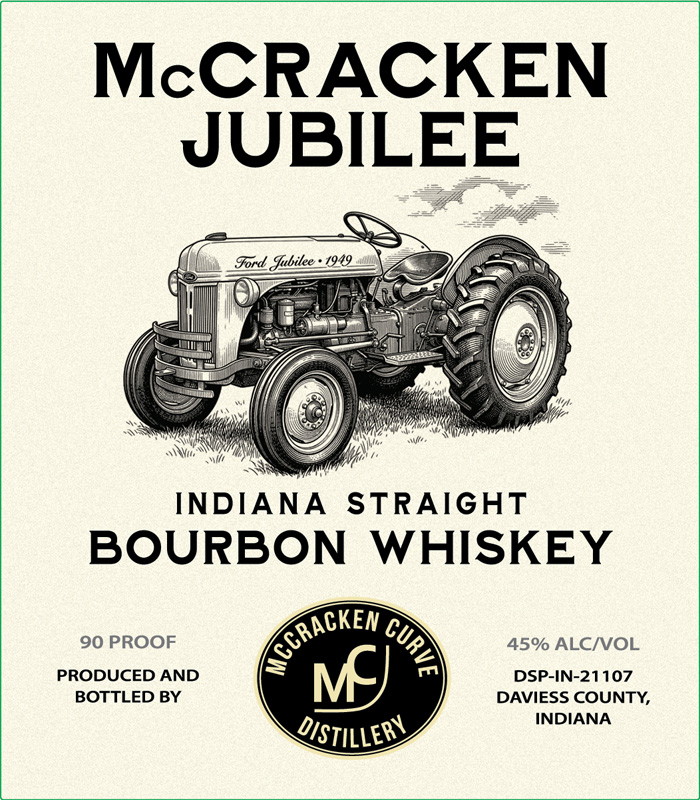
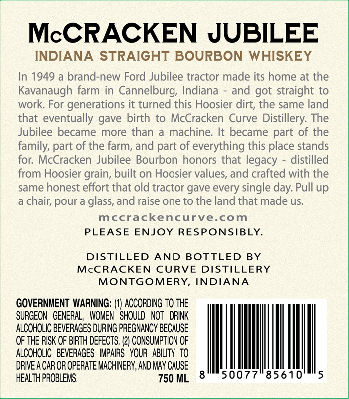

# TTB COLA Label Images - TTBID 26128001000815

**Brand Name:** MCCRACKEN JUBILEE BOURBON

**Issue Date:** 05/13/2026

**Origin Code:** 19

**Product Class/Type:** 101

**Source:** [TTB Public COLA Registry](https://ttbonline.gov/colasonline/viewColaDetails.do?action=publicFormDisplay&ttbid=26128001000815)

## Label Images

### Label 1

### Label 2

## Extracted Label Text

*Text extracted via OCR - may contain errors*

**Detected Proof:** 90

### Label 1

McCRACKEN
JUBILEE
Ford  fubitee
INDIANA
STRAIGHT
BOURBON
WHISKEY
90 PROOF
45% ALCNOL
PRODUCED AND
DSP-IN-21107
BOTTLED BY
DAVIESS COUNTY,
INDIANA
DISTILLEBY
KCRACKEN
9
MJ

### Label 2

McCRACKEN JUBILEE
INDIANA STRAIGHT BOURBON WHISKEY
In 1949
a brand-new Ford Jubilee tractor made its home at the
Kavanaugh farm in Cannelburg; Indiana
and got straight to
work: For generations it turned this Hoosier dirt; the same land
that eventually gave birth to McCracken Curve Distillery: The
Jubilee became more than
machine: It became part of the
family; part of the farm; and part of everything this place stands
for: McCracken Jubilee Bourbon honors that legacy
distilled
from Hoosier grain; built on Hoosier values, and crafted with the
same honest effort that old tractor gave every single day: Pull up
chair; pour a glass, and raise one to the land that made us.
mccrackencurve.com
PLEASE
ENJOY RESPONSIBLY.
DISTILLED
AND
BOTTLED
BY
McCRACKEN
CURVE
DISTILLERY
MONTGOMERY,
INDIANA
GOVERNMENT WARNING: (V) ACCORDING to THE
SURGEON   GENERAL   WOMEN ^ SHOULD  NOT   DRINK
ALCOHOLIC BEVERAGES DURING PREGNANCY BECAuSe
OF THE RISK OF BIRTH deFects: (2) CONSUMPTION OF
ALCOHOLIC  BEVERAGES  IMPAIRS   YOUR   ABILITY to
DRIVE A CAR OR OPERATE MACHINERY; AND MAY CAUSE
HEALTH PROBLEMS,
750 ML
50077"85610
5
