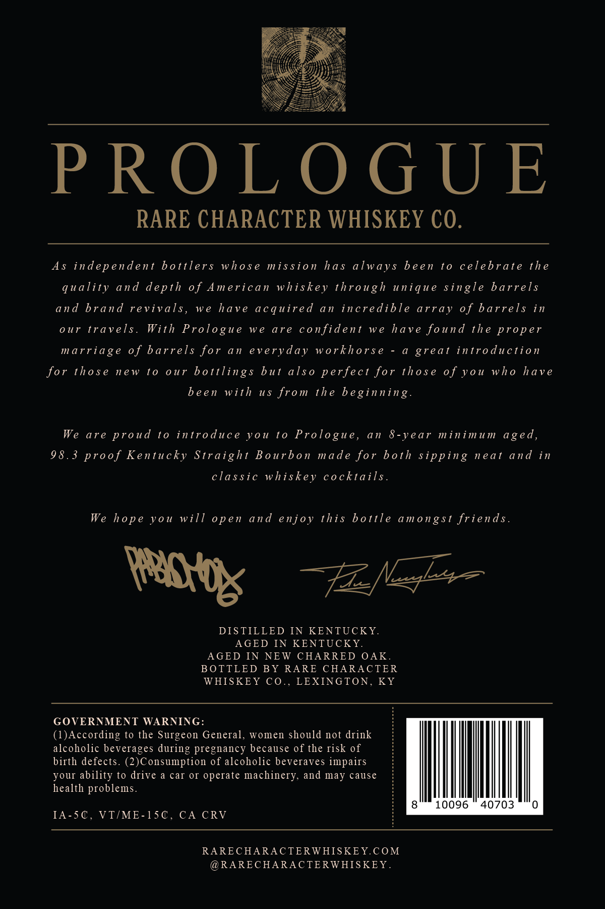
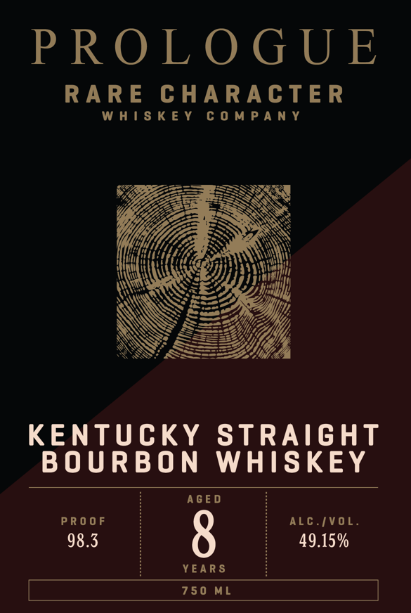

# TTB COLA Label Images - TTBID 26129001000009

**Brand Name:** RARE CHARACTER

**Fanciful Name:** PROLOGUE

**Issue Date:** 05/15/2026

**Origin Code:** 22

**Product Class/Type:** 101

**Source:** [TTB Public COLA Registry](https://ttbonline.gov/colasonline/viewColaDetails.do?action=publicFormDisplay&ttbid=26129001000009)

## Label Images

### Back Label

### Front Label

## Extracted Label Text

*Text extracted via OCR - may contain errors*

**Detected Proof:** 98.3

### Back Label

PROLOGUE

RARE CHARACTER WHISKEY CO.

As independent bottlers whose mission has always been to celebrate the
quality and depth of American whiskey through unique single barrels
and brand revivals, we have acquired an incredible array of barrels in
our travels. With Prologue we are confident we have found the proper
marriage of barrels for an everyday workhorse - a great introduction
for those new to our bottlings but also perfect for those of you who have

been with us from the beginning.
We are proud to introduce you to Prologue, an 8-year minimum aged,
98.3 proof Kentucky Straight Bourbon made for both sipping neat and in

classic whiskey cocktails.

We hope you will open and enjoy this bottle amongst friends.

Foe ect =

DISTILLED IN KENTUCKY.
AGED IN KENTUCKY.
AGED IN NEW CHARRED OAK.
BOTTLED BY RARE CHARACTER
WHISKEY CO., LEXINGTON, KY

GOVERNMENT WARNING:
(1)According to the Surgeon General, women should not drink
alcoholic beverages during pregnancy because of the risk of
birth defects. (2)Consumption of alcoholic beveraves impairs
your ability to drive a car or operate machinery, and may cause
health problems.
8 10096 40703

IA-5C@, VT/ME-15€, CA CRV

RARECHARACTERWHISKEY.COM
@RARECHARACTERWHISKEY.

### Front Label

PROLOGUE

RARE CHARACTER

WHISKEY COMPANY

&

SS

a

HATHA

AAAS

p)

aay

Ayia

|

q

RX

\h

ll

ll

Up

.

SS

Wf

KENTUCKY STRAIGHT

BOURBON WHISKEY

AGED

PROOF

ALC./VOL.

98.3

49.15%

YEARS

750 ML
