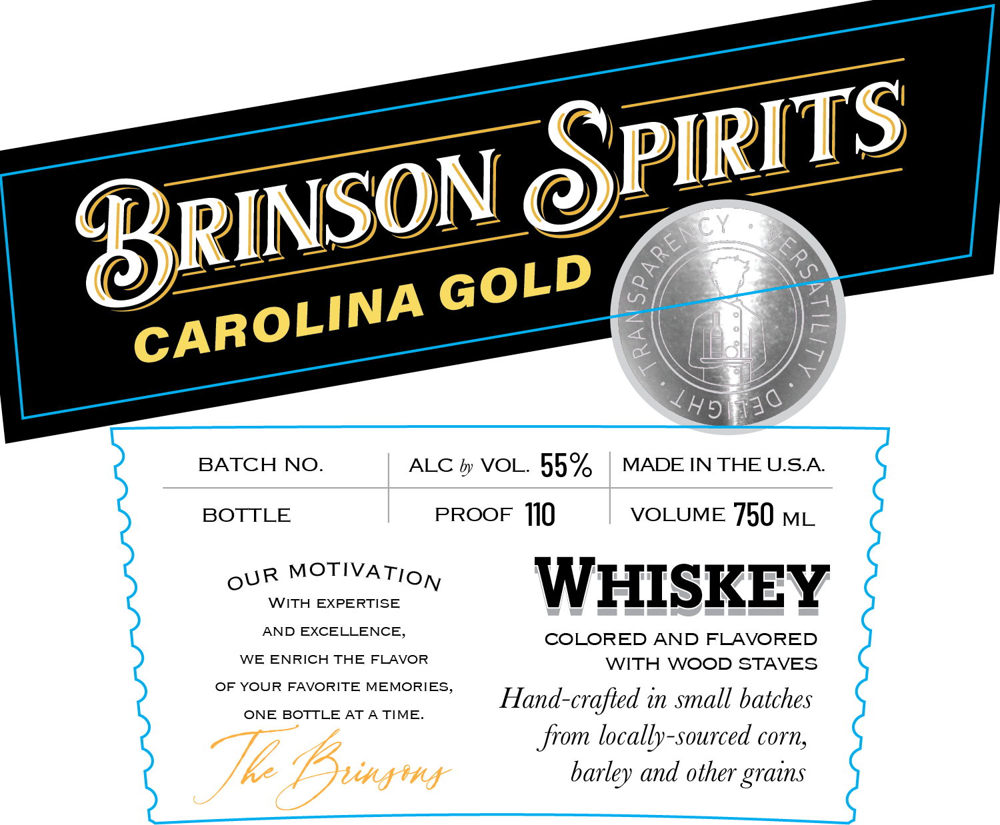

# TTB COLA Label Images - TTBID 26129001000071

**Brand Name:** BRINSON SPIRITS

**Fanciful Name:** CAROLINA GOLD WHISKEY

**Issue Date:** 05/15/2026

**Origin Code:** 41

**Product Class/Type:** 140

**Source:** [TTB Public COLA Registry](https://ttbonline.gov/colasonline/viewColaDetails.do?action=publicFormDisplay&ttbid=26129001000071)

## Label Images

### Back Label

### Front Label

## Extracted Label Text

*Text extracted via OCR - may contain errors*

**Detected Proof:** 110

### Back Label

®RINSON SPIRITS

BRINSONSPIRITS.COM

Shr WARNING: (1 ae my THE SURGEON GENERAL WOMEN

HOULD NOT DRINK

DURING

CY BECAU

tf THE RISK OF BIRTH TEES 0) CEASED OF ALCOHOLIC BEV-

ERAGES IMPAIRS YOUR ABILITY TO DRIVE ACAR OR OPERATE MACHINERY, AND

MAY CAUSE HEALTH PROBLEMS

DISTILLED BY BRINSON SPIRITS, LLC, BLACKSBURG, SC

### Front Label

@
8
2
L05in30
BATCH NO.
ALC by VOL.
55%
MADE IN THE USA
BOTTLE
PROOF
110
VOLUME 750 ML
WITH
MOTIVATION
EXPERTISE
WHISKEY
AND EXCELLENCE,
COLORED AND FLAVORED
WE ENRICH THE FLAVOR
WITH WOOD STAVES
OF YOUR
FAVORITE
MEMORIES
Hand-crafted in small batches
ONE BOTTLE AT A TIME_
from locally-sourced corn,
T2 'Bungmy
barley and other
PIRITS
RINSON
GPARENCP
3
GOLD
CAROLINA
OUR
grains
