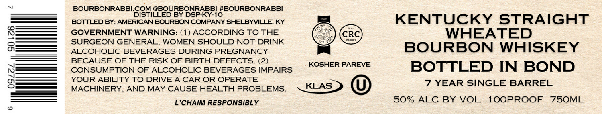

# TTB COLA Label Images - TTBID 26130001000078

**Brand Name:** BOURBONRABBI

**Issue Date:** 05/14/2026

**Origin Code:** 22

**Product Class/Type:** 111

**Source:** [TTB Public COLA Registry](https://ttbonline.gov/colasonline/viewColaDetails.do?action=publicFormDisplay&ttbid=26130001000078)

## Label Images

### Label 1

### Label 2

## Extracted Label Text

*Text extracted via OCR - may contain errors*

*1 image(s) excluded: text did not meet readability threshold*

**Detected Proof:** 100
**Detected Age:** 7 Years

### Label 1

BOURBONRABBI.COM @BOURBONRABBI #BOURBONRABBI
DISTILLED BY DSPKY-10
BOTTLED BY: AMERICAN BOURBON COMPANY SHELBYVILLE KY
KENTUCKY STRAIGHT
GOVERNMENT WARNING: ( 1) ACCORDING TO THE
CRC
WHEATED
8
SURGEON GENERAL
WOMEN SHOULD NOT DRINK
ALCOHOLIC BEVERAGES DURING PREGNANCY
BOURBON WHISKEY
BECAUSE OF THE RISK OF BIRTH DEFECTS
(2)
KOSHER PAREVE
CONSUMPTION OF ALCOHOLIC BEVERAGES IMPAIRS
BOTTLED
IN BOND
8
YOUR ABILITY TO DRIVE A CAR OR OPERATE
7 YEAR SINGLE
BARREL
MACHINERY
AND MAY CAUSE HEALTH PROBLEMS_
KLAS
L'CHAIM RESPONSIBLY
50% ALC BY VOL
1OOPROOF
75OML
