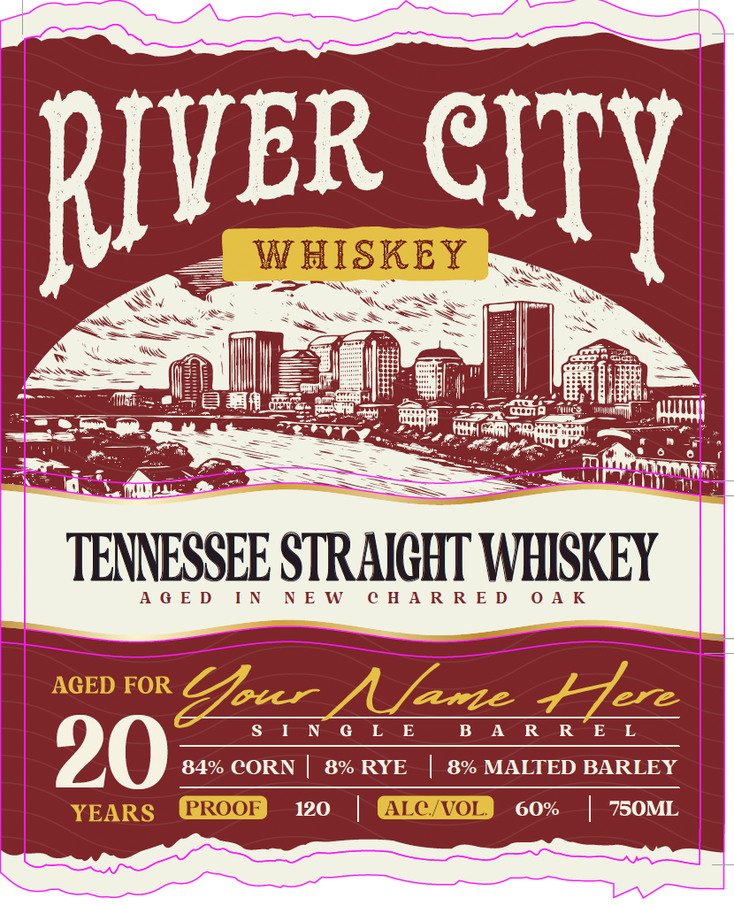
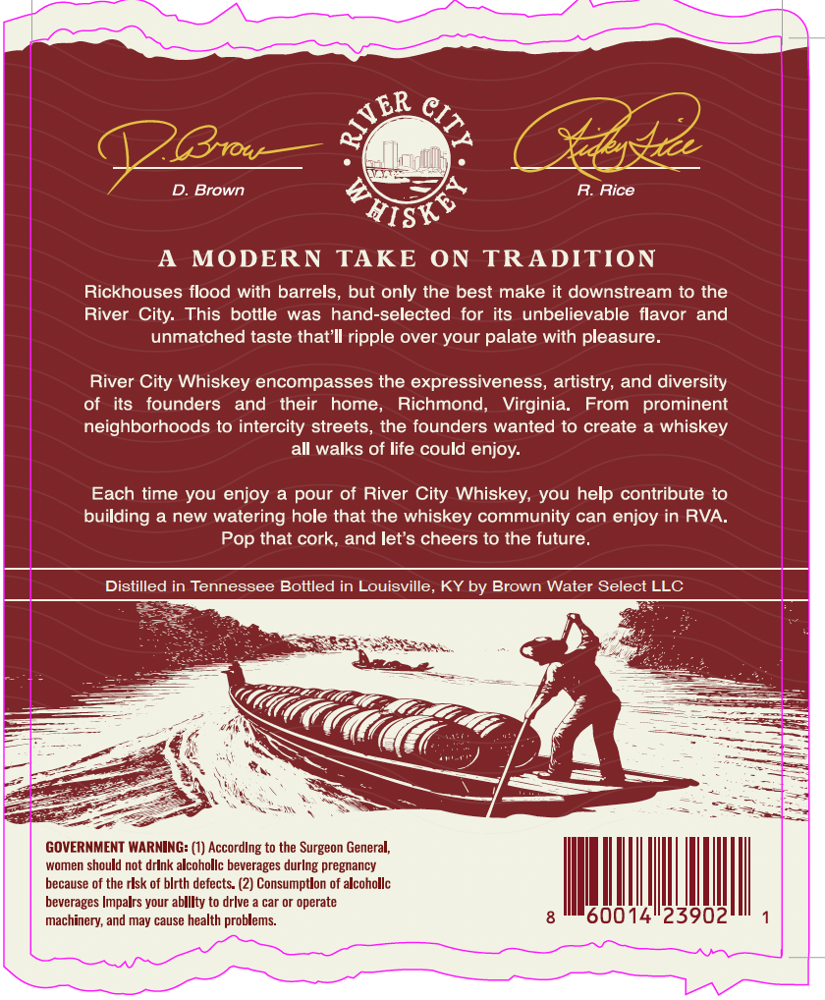
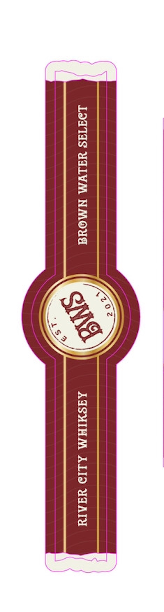

# TTB COLA Label Images - TTBID 26131001000041

**Brand Name:** RIVER CITY WHISKEY

**Issue Date:** 06/09/2026

**Origin Code:** 22

**Product Class/Type:** 109

**Source:** [TTB Public COLA Registry](https://ttbonline.gov/colasonline/viewColaDetails.do?action=publicFormDisplay&ttbid=26131001000041)

## Label Images

### Label 1

### Label 2

### Label 3

## Extracted Label Text

*Text extracted via OCR - may contain errors*

### Label 1

=

RIVER CITY

~ TENNESSEE STRAIGHT WHISKEY

AGED IN NEW CHARRED OAK

Sa NO) EE BAR REL
84% CORN | 8% RYE | 8% MALTED BARLEY

0 | 60% | 750ML

### Label 2

ER
'(3row
Brown
MISK$
A
MODERN
TAKE
ON
TRADITION
Rickhouses flood with barrels, but only the best make it downstream to the
River
This bottle
was hand-selected for its unbelievable flavor
and
unmatched taste thatIl ripple over your palate with pleasure
River City Whiskey encompasses the expressiveness, artistry; and diversity
of   its
founders
and
their   home,
Richmond,
Virginia.
From
prominent
neighborhoods to intercity streets, the founders wanted to create
whiskey
all walks of life could enjoy:
Each time you enjoy a pour of River
Whiskey; you help contribute to
building
a new
watering hole that the whiskey community can enjoy in RVA:
Pop that cork, and let's cheers to the future_
Distilled in Tennessee Bottled in Louisville
KYby Brown Water Select LLC
GOVERNMENT WARMING: (1) Accordlng to the Surgeon General;
women should not drink alcohollc beverages durlng pregnancy
because of the rlsk of blrth defects: (2) Consumptlon of alcohollc
beverages Impalrs your ablllty to drlve
car or operate
machinery; and may cause health problems:
2390
CIT}
3
Rice
City:
City

### Label 3

LdIATYS UALYM NMOUG | | AYSMIHM ALIo YSATY
