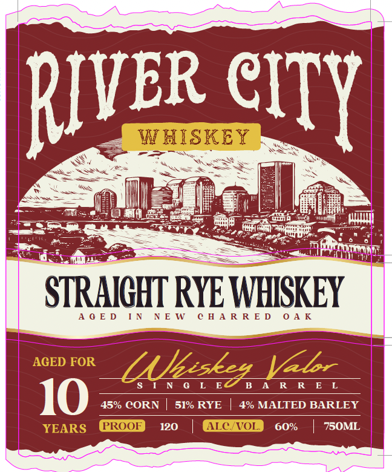
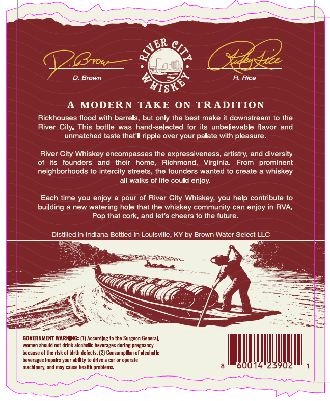

# TTB COLA Label Images - TTBID 26131001000043

**Brand Name:** RIVER CITY WHISKEY

**Issue Date:** 06/09/2026

**Origin Code:** 22

**Product Class/Type:** 102

**Source:** [TTB Public COLA Registry](https://ttbonline.gov/colasonline/viewColaDetails.do?action=publicFormDisplay&ttbid=26131001000043)

## Label Images

### Label 1

### Label 2

### Label 3

## Extracted Label Text

*Text extracted via OCR - may contain errors*

### Label 1

R SN KOSS Bi
Sas = —_ Sey
TS ge ST | GS
a | Mat an wha. ;
SSE etter ae
> SEEM eee
eS eerie mes UNE
- AGED IN NEW CHARRED ase
ee
PASSING INES BAC ROR ESE
10 45% CORN | 51% RYE | 4% MALTED BARLEY

120 | 60% | 750ML

### Label 2

LdIATYS UALYM NMOUG | | AYSMIHM ALIo YSATY

### Label 3

ER C
BvoW
D. Brown
MODERN
TAKE ON TRADITION
Rickhouses flood with barrels
but only the best make it downstream t0 the
River
This bottle
was hand-selected for its unbelievable flavor
and
unmatched taste that Il ripple over your palate with pleasure
River
Whiskey encompasses the expressiveness
artistry; and diversity
founders
and
their
home;
Richmond
Virginia:
From
prominent
neighborhoods t0 intercity streets, the founders wanted t0 create
whiskey
all walks of life could enjoy:
Each time you enjoy
pour of River City Whiskey; you help contribute to
building
new
watering hole that the whiskey community can enjoy in RVA ,
that cork, and Iet's cheers t0 the future
Distilled in Indiana Bottled in Louisville, KY by Brown Water Select LLC
GOVERMMENT WARNING: (V) Accordlng
the Surgeon General;
Womem
not dmbk alcoho
beverages during pregnancy
because of the dsk of blrth defects. (2) Consumptlon of alcohollc
bevcrages Impalrs your abllty
One & car
operatc
machlneny; and may cause health probleins.
2
Alce
ISK
City:
City
Pop
snculd
