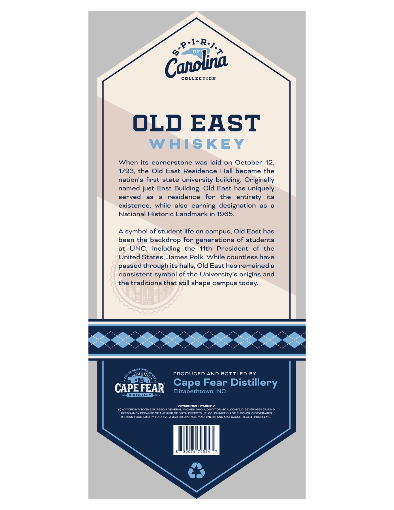
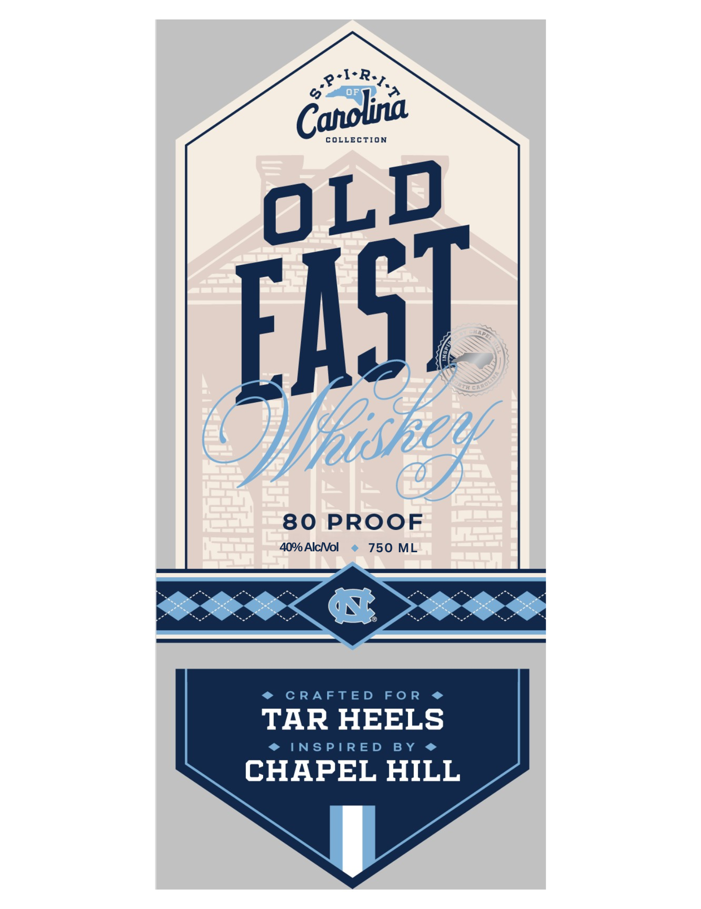

# TTB COLA Label Images - TTBID 26131001000136

**Brand Name:** SPIRIT OF CAROLINA

**Fanciful Name:** OLD EAST WHISKEY

**Issue Date:** 05/15/2026

**Origin Code:** 35

**Product Class/Type:** 140

**Source:** [TTB Public COLA Registry](https://ttbonline.gov/colasonline/viewColaDetails.do?action=publicFormDisplay&ttbid=26131001000136)

## Label Images

### Back Label

### Front Label

## Extracted Label Text

*Text extracted via OCR - may contain errors*

**Detected Proof:** 80

### Back Label

&P-I-RtaA
COLLECTION
OLD
EAST
WHISKEY
When its
cornerstone
was laid on October 12,
1793, the Old East
Residence Hall became the
nation's first state university
building: Originally
named just East
Building; Old East has uniquely
served
as
residence
for
the
entirety
its
existence,
while
also
designation
as
National Historic Landmark in 1965.
A
symbol of student life on campus, Old East has
been the backdrop for generations of students
at
UNC,
including the
I1th
President
of
the
United States, James Polk. While countless have
passed through its halls, Old East has remained a
consistent symbol of the University's origins and
the traditions that still shape campus
8888888888
PRODUCED
AND BOTTLED BY
CAPEFEAR
Cape Fear Distillery
Elizabethtown; NC
'OISLLERYA
OOVERNMENTWARNINO
MTACCORDING TOTHE SURGEONGENERAL
WOMEN SHOULDNOT DRINK ALCOHOLIC DEVERAGES DURINO
PREGNANCY EECAUSE OF THE RISKOl BIRTADEFECTS. (21 CONSUMPTIONOF ALCOHOLIC BEVERAGES
IMPAIRS YOUR ADILITYTO DRIVE ACaPOR OPERATEMACHINERYANDMay CaUse HealthProdlEMS
00
79 52
Canola
earning
today:

### Front Label

oRa
COLLECTION
Whtshenf
80 PROOF
40% AlcNol
750 ML
C RA FT ED
F0 R
TAR HEELS
INS PIR E D
B Y
CHAPEL HILL
Caholna
OLD
EaST
