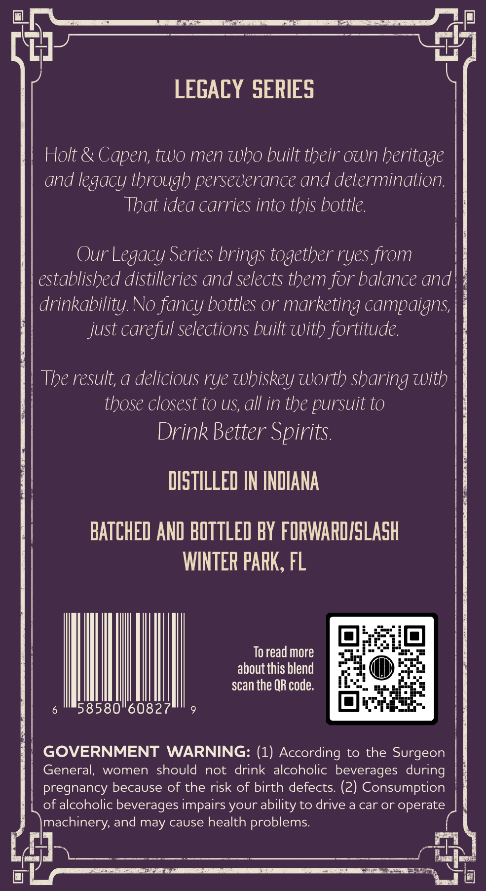
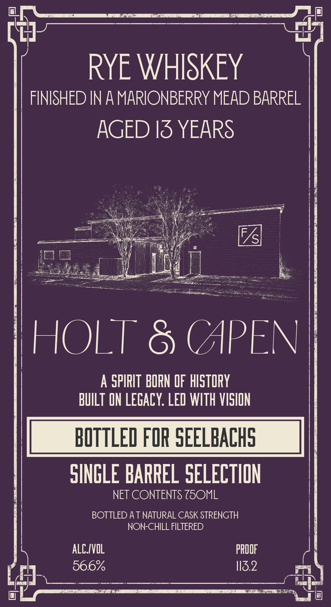

# TTB COLA Label Images - TTBID 26131001000141

**Brand Name:** HOLT & CAPEN

**Issue Date:** 05/14/2026

**Origin Code:** 16

**Product Class/Type:** 142

**Source:** [TTB Public COLA Registry](https://ttbonline.gov/colasonline/viewColaDetails.do?action=publicFormDisplay&ttbid=26131001000141)

## Label Images

### Back Label

### Front Label

## Extracted Label Text

*Text extracted via OCR - may contain errors*

**Detected Proof:** 113.2

### Back Label

LEGACY SERIES
Holt & Capen; two men who built their Own heritage
and legacy through perseverance and determination:
That idea carries into this bottle
Our Legacy Series brings together ryes from
established distilleries and selects them for balance and
drinkability No fancy bottles or marketing campaigns;
just careful selections built with fortitude.
The result, a delicious rye whiskey worth sharing with
those closest to US, all in the pursuit to
Drink Better Spirits
DISTILLED IN INDIANA
BATCHED AND BOTTLED BY FORWARDISLASH
WINTER PARK, FL
To read more
about this blend
scan the QR code:
58580"60827
GOVERNMENT
WARNING: (1) According to the Surgeon
General,
women
should
not drink alcoholic beverages during
pregnancy because of the risk of birth defects: (2) Consumption
of alcoholic beverages impairs your ability to drive a car or operate
machinery, and may cause health problems:

### Front Label

RYE WHISKEY
FINISHED IN A MARIONBERRY MEAD BARREL
AGED I3 YEARS
F
/s
HOLT 8 (APEN
A SPIRIT BORN OF hISTORY
BUILT ON LEGAcY: LED WITh VISION
BOTTLED FOR SEELBACHS
SINGLE BARREL SELECTHON
NET CONTENTS Z5OML
BOTTLED A T NATURAL CASK STRENGTH
NON-CHILL FILTERED
ALCIVOL
PRODF
56.6%
113.2
