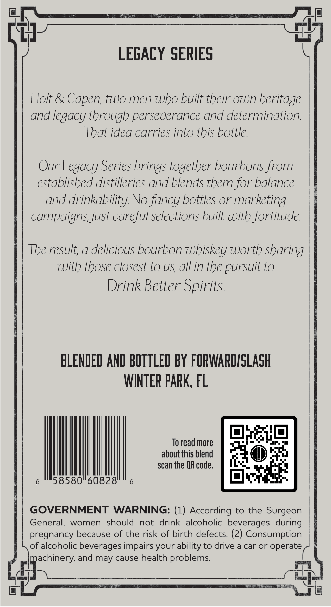
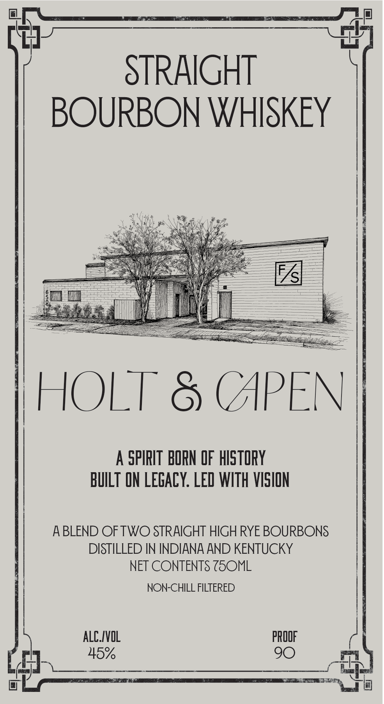

# TTB COLA Label Images - TTBID 26131001000147

**Brand Name:** HOLT & CAPEN

**Issue Date:** 05/14/2026

**Origin Code:** 16

**Product Class/Type:** 101

**Source:** [TTB Public COLA Registry](https://ttbonline.gov/colasonline/viewColaDetails.do?action=publicFormDisplay&ttbid=26131001000147)

## Label Images

### Back Label

### Front Label

## Extracted Label Text

*Text extracted via OCR - may contain errors*

**Detected Proof:** 90

### Back Label

LEGACY SERIES
Holt & Capen; two men who built their own heritage
and legacy through perseverance and determination.
That idea carries into this bottle.
Our Legacy Series brings together bourbons from
established distilleries and blends them for balance
and drinkability No fancy bottles or marketing
campaigns, just careful selections built with fortitude.
The result; a delicious bourbon whiskey worth sharing
With those closest to US; all in the pursuit to
Drink Better Spirits
BLENDED AND BOTTLED BY FORWAPDISLASH
WINTER paRK, FL
To read more
about this blend
scan the QR code.
58580"60828"
GOVERNMENT
WARNING: (1) According to the Surgeon
General;,
women
should
not
drink alcoholic beverages during
pregnancy because of the risk of birth defects (2) Consumption
of alcoholic beverages impairs your ability to drive a car or operate
machinery; and may cause health problems

### Front Label

74
STRAIGHT
BOURBON WHISKEY
HOLT
(APEN
A
SPIRIT  BORN OF HISTORY
BuILT ON LEGACY: LED WITH VISION
ABLEND OFTWO STRAIGHT HIGH RYE BOURBONS
DISTILLED IN INDIANA AND KENTUCKY
NET CONTENTS ZSOML
NON-CHILL FILTERED
aLC /VOL
pROOF
45%
