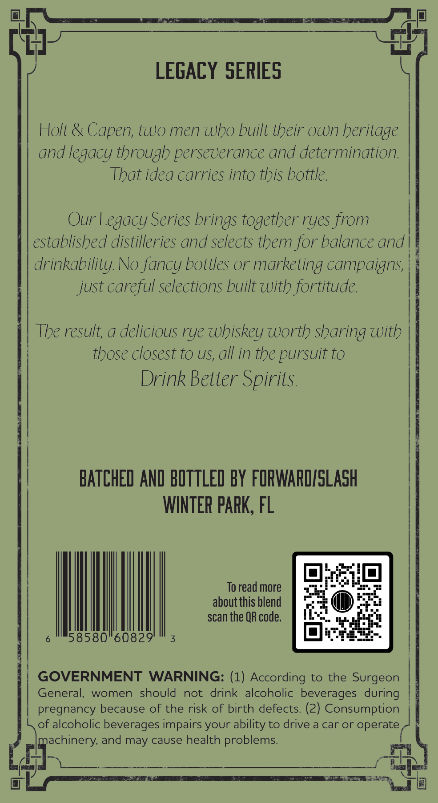
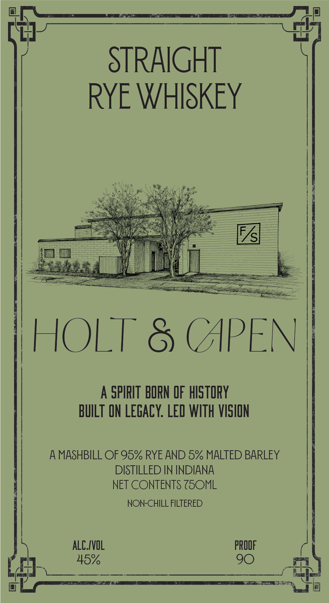

# TTB COLA Label Images - TTBID 26131001000179

**Brand Name:** HOLT & CAPEN

**Issue Date:** 05/15/2026

**Origin Code:** 16

**Product Class/Type:** 102

**Source:** [TTB Public COLA Registry](https://ttbonline.gov/colasonline/viewColaDetails.do?action=publicFormDisplay&ttbid=26131001000179)

## Label Images

### Back Label

### Front Label

## Extracted Label Text

*Text extracted via OCR - may contain errors*

**Detected Proof:** 90

### Back Label

LEGACY SERIES
Holt & Capen, two men who built their own heritage
and legacy through perseverance
determination.
That idea carries into this bottle.
Our Legacy Series brings together ryes from
established distilleries and selects them for balance and
drinkability No fancy bottles or marketing campaigns
just careful selections built with fortitude
The result; a delicious rye Whiskey Worth sharing with
those closest to US, all in the pursuit to
Drink Better Spirits
BATCHED AND BOTTLED BY FORWARDISLaSh
WINTER PARK, FL
To read more
about this blend
scan the QR code;
58580"60829'
GOVERNMENT
WARNING: (1) According to the Surgeon
General;
women
should
not
drink alcoholic beverages during
pregnancy because of the risk of birth defects (2) Consumption
of alcoholic beverages impairs your ability to drive a car or operate _
machinery, and may cause health problems:
and

### Front Label

STRAIGHT
RYE WHISKEY
F/s
HOLT
(APEN
A SPIRIT BORN OF hIStoRY
BUILT ON LEGAcY: LED WITH VISHON
4
MASHBILL OF 95% RYE AND 5% MALTED BARLEY
DISTILLED IN INDIANA
NET CONTENTS ZSOML
NON-CHILL FILTERED
alC/VOL
PROOF
45%
90
Benec
