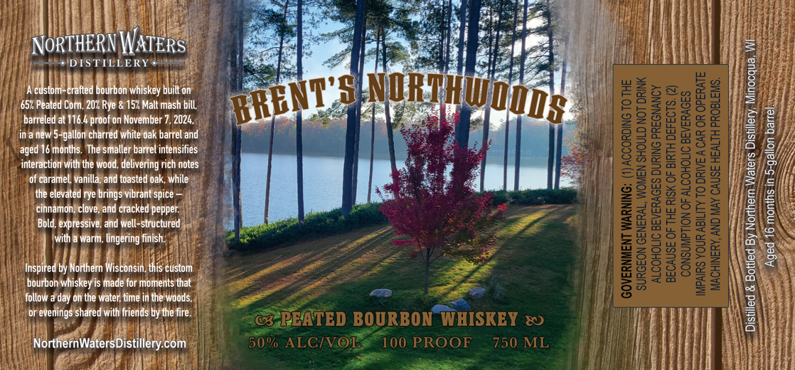

# TTB COLA Label Images - TTBID 26131001000316

**Brand Name:** BRENT'S NORTHWOODS

**Issue Date:** 05/14/2026

**Origin Code:** 48

**Product Class/Type:** 141

**Source:** [TTB Public COLA Registry](https://ttbonline.gov/colasonline/viewColaDetails.do?action=publicFormDisplay&ttbid=26131001000316)

## Label Images

### Label 1

## Extracted Label Text

*Text extracted via OCR - may contain errors*

### Label 1

TERRE o eMlltareted: | ERG at ae yo eg a eI VPERUEG bee it
LU a eer
NORTHERNWATERS GbR Beri bcgmalt | | lll le) |
= ++4\DISTIELERY 6345 3! Sa; ae | ae Sar hy ame Ae! PEEL Wi Hage
(10) EA he ase ee iis so fe ‘ eer 8 Pa Vel S Pekee
TALUS Ba es : ss TSNORTHW OD 4 | te WEdE
651 Peat CoM, 207 Rye & 15% Malt mash bl, “ag | ene, Us ees
batréled at 116 4proofon November 7, 2024, ete ed eat ae |e Fe cai His Sif
ina dw 5 gallon charréd white'6ak barre and aaah gee ‘3 ! 4 ey;
aged 16 months. Thé’smaller barrel intensifies al aaa ee thie sy
interaction withthe Wodd, delivering richinotes. | ae peg) esis) I]
of Caramel anil afd toastel oak. Wile | = ad F | Ps Wesel
the elevated rye brings vibrant’spice — ; a ea His eit
cinnamantecloveland cracked pepper) = | WHE |S ae
Bold, expressive, and well-structured ,./° Vie ie
| ‘with @ Warm. lingeting finish. ’@ = has SS

A LIRR EL Veet W\WSroee

ins dd litidh Histonsi thie tiston \\ = od
bouton whiskey/s had for moments that ee = \\ Wek
follow 2 day onthe wate ime i theAWaods, - =~ Vie ees
|) || pr eberings'shared with friends bythe fire. aT VETERE Wis al
| ee Be alias PETE GSU EEE
Nortfigfnwatersbistillerycom aie | +h ma
Me” AE | NaN at BELEELIN ipiaibaae
