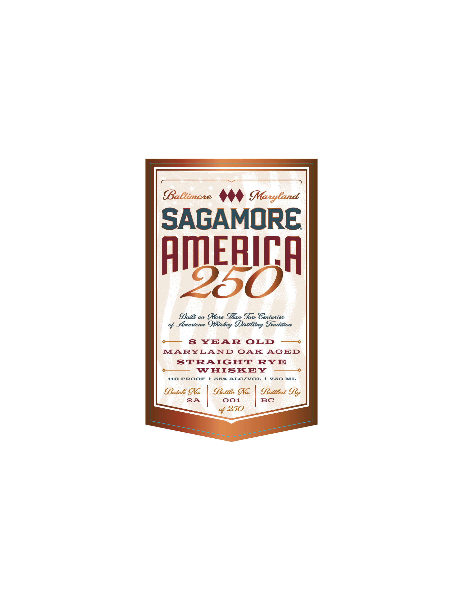
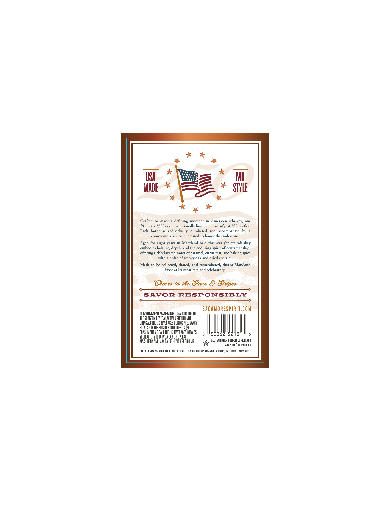

# TTB COLA Label Images - TTBID 26131001000399

**Brand Name:** SAGAMORE

**Fanciful Name:** AMERICA 250

**Issue Date:** 05/18/2026

**Origin Code:** 25

**Product Class/Type:** 102

**Source:** [TTB Public COLA Registry](https://ttbonline.gov/colasonline/viewColaDetails.do?action=publicFormDisplay&ttbid=26131001000399)

## Label Images

### Label 1

### Label 2

## Extracted Label Text

*Text extracted via OCR - may contain errors*

**Detected Proof:** 110
**Detected Age:** 8 Years

### Label 1

BaCtimote
Maryland
SAGAMORE
pmBTn
Buiet on Mate Ran Jub Genturies
Emetican Oliahey Iiatilling Tadition
8
YEAR
OLD
MARYLAND
OAK
AGED
STRAIGHT
RYE
WHISKEY
110 PROOF
55% ALC/VOL
750
ML
Batch Io;
Bottee Io:
Sotteed SBy
2A
001
BC
250

### Label 2

USA
MD
MADe
STVLE
Crafted
mark
defining
moment in
American   whiskey;
our
"America 250" is an exceptionally limited release ofjust 250 bottles:
Each
bottle
individually
numbered
and   accompanied
by
commemorative coin, created to honor this milestone_
Aged for eight years in Maryland oak, this straight
rye
whiskey
embodies balance; depth, and the enduring
of craftsmanship,
offering richly layered notes of caramel, citrus zest, and
spice
with
finish of smoky oak and dried cherries.
Made to be collected, shared, and
remembered; this is Maryland
Style at its most rare and
celebratory;
Greers ta tRe Stars 8
SAvor
RESPONSIBLY
SAGAMORESpirit.COM
GOVERNMENT WARNING:
ACCORDINGTO
THE SURGEON GENERAL, WOMEN ShOuLD NOT
DFINK ALCOHOLIC BEVERAGES DURING PREGNANCY
BECAUSE OFTHE FISK OF BIRTH DEFECTS
CONSUMFTHON OF ALCOHOLIC BEVERAGES IPAIRS
50062152131
VOUR ABILITY TO DRIVE A CAR OR OPERATE
MACHINERK AND MAV CAUSE HEALTH PROBLEMS
GLUTEN FREE - NOM-CHILL FILTERED
CA CRV MEI-VT ISC IA 5C
AGED IN NEW CHARRED OAK BARRELS . distilled
BOTTLed BY SAGAMORE WhISKEY, BALTIMORE , MARYLAND:
spirit ,
baking
Sbripes
