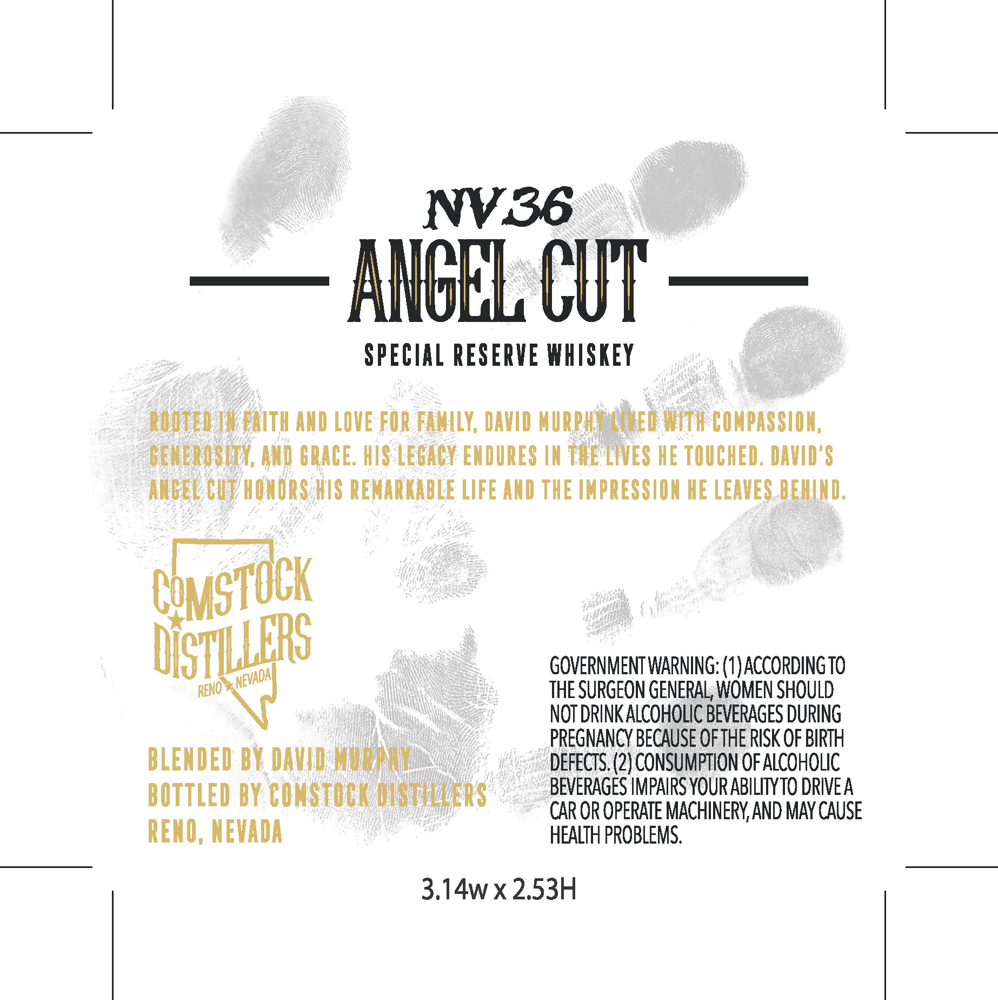
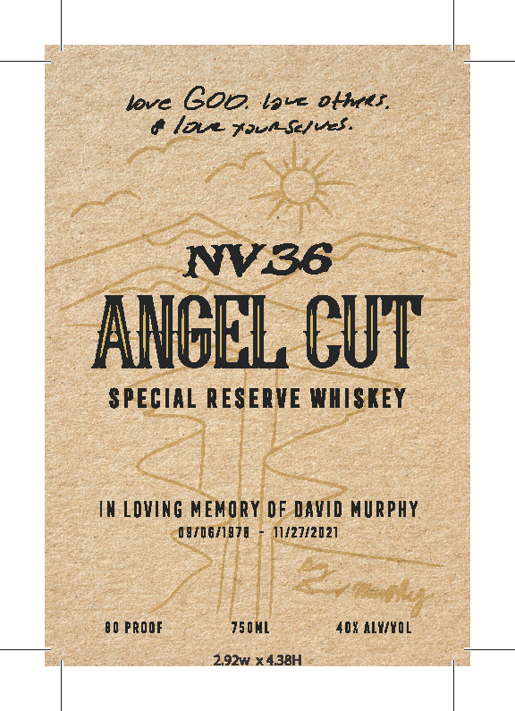

# TTB COLA Label Images - TTBID 26131001000405

**Brand Name:** NV36 ANGEL CUT

**Issue Date:** 05/14/2026

**Origin Code:** 32

**Product Class/Type:** 140

**Source:** [TTB Public COLA Registry](https://ttbonline.gov/colasonline/viewColaDetails.do?action=publicFormDisplay&ttbid=26131001000405)

## Label Images

### Back Label

### Front Label

## Extracted Label Text

*Text extracted via OCR - may contain errors*

**Detected Proof:** 80

### Back Label

NV36
ANBEL CUT
SPECIAL RESERVE WHISKEY
ROOTED INEAITH AND LOVE FOR FAMILY, DAVID MURPHA: (aXev WIth COMPASSIOM;,
GENEROSUTX, AND GRACE. HIS LEGaCY ENDURES IN TRE LIvES HE TOUCHED, DAVID'$
ANBEL CUT/ HONORS HIS REMARKABLE LIFE AnD THE IMPRESSION HE LEAVES BEHIND;
GOVERNMENT WARNING; (1 ) ACCORDING TO
THE SURGEON GENERAL; WOMEN SHOULD
NOT DRINK ALCOHOLIC BEVERAGES DURING
PREGNANCY BECAUSE OFTHE RISK OF BIRTH
BLENDED BY DAVID h
DEFECTS: (2) CONSUMPTION OF ALCOHOLIC
BOTTLED BY COMSTOOK DEILERS
BEVERAGES IMPAIRS YOURABILITYTO DRIVEA
CAR OR OPERATE MACHINERYAND MAY CAUSE
RENO, NEVADA
HEALTH PROBLEMS.
3.14wx2.53H
COMSTOCK
USTLLLERS
NEVADA
RENO

### Front Label

love COP, lave oftees,

OL Fare Se/eed.

ANGEL CUT

SPECIAL RESERVE WHISKEY

IN LOVING MEMORY OF DAVID MURPHY

OHFDGAIETE - 11/27/2021

80 PROOF

TS0ML

40% ALY/YOL

2.92w x 4.38H
