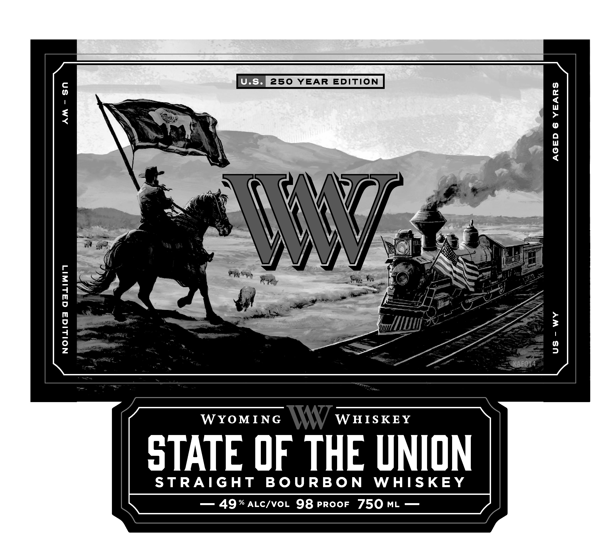
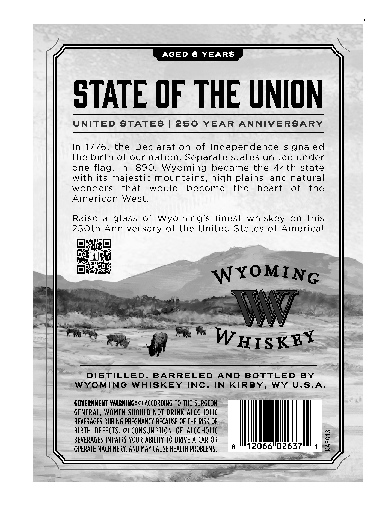
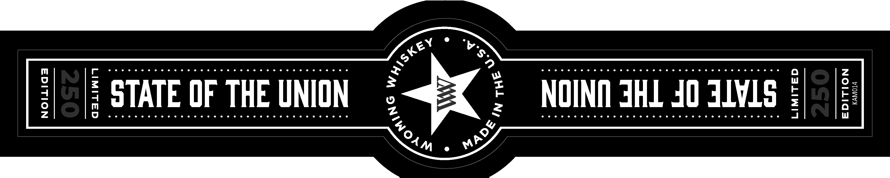

# TTB COLA Label Images - TTBID 26131001000514

**Brand Name:** WYOMING WHISKEY

**Fanciful Name:** STATE OF THE UNION

**Issue Date:** 05/18/2026

**Origin Code:** 49

**Product Class/Type:** 101

**Source:** [TTB Public COLA Registry](https://ttbonline.gov/colasonline/viewColaDetails.do?action=publicFormDisplay&ttbid=26131001000514)

## Label Images

### Label 1

### Label 2

### Label 3

## Extracted Label Text

*Text extracted via OCR - may contain errors*

**Detected Age:** 6 Years

### Label 1

Ue 250 YEAR EDITION

AGED 6 YEARS

c
=
|
m
0
m
2
a E
O |
Zz

WYOMING WHISKEY

OTATE OF THE UNION

STRAIGHT BOURBON WHISKEY

### Label 2

AGED
6
YEARS
STATE OF THE UNION
UNITED
STATES
250
YEAR
ANNIVERSARY
In
1776,
the
Declaration
of Independence signaled
the birth of our nation: Separate states united under
one flag.
In 1890,
Wyoming
became
the
44th
state
with its majestic mountains, high plains, and natural
wonders
that
would
become
the
heart
of
the
American
West.
Raise
a
glass
of
Wyoming's
finest
whiskey
on
this
250th Anniversary of the United States of Americal
WYoMING
W
WHISKEY
DISTILLED,
BARRELED
AND
BOTTLED
BY
WYOMING
WHISKEY
INC.
IN
KIRBY,
WY
U.S.A.
GOVERNMENT WARNING: () ACCORDINg TO THE  SURGEON
GENERAL, WOMEN SHOULD NOT DRINK Alcoholic
BEVERAGES DURING PREGNANCY BECAUSE OF THE RISK OF
BIRTH
DEFECTS.
(2) CONSUMPTION OF alcoholic
BEVERAGES IMPAIRS YOUR ABILITY TO DRIVE A CAR OR
1
OPERATE MACHINERY, AND MAY CAUSE HEALTh PROBLEMS.
8
12066"02637

### Label 3

Ce ee 2

eeceewr eee ee eee wee wee ee ee he he hh eh Hh Oh hh OO he he

:| STATE OF THE UNION

eoeceenrecee ese eee eee eee eee eee eee wee eee eee

Ra

evoeveeee eee nese eee cen eee eee ees ewe see oe

NOINN HJ 40 JVs §)

NE FP
