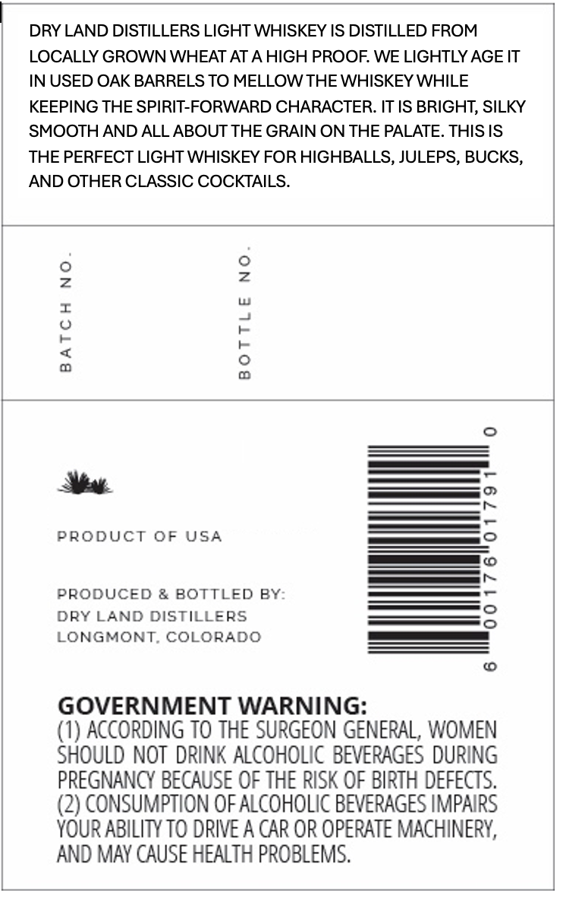
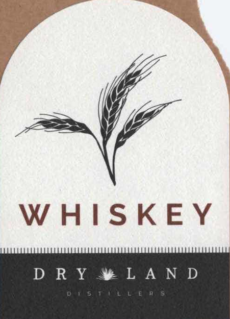
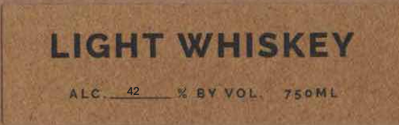

# TTB COLA Label Images - TTBID 26131001000671

**Brand Name:** DRY LAND DISTILLERS

**Issue Date:** 06/26/2026

**Origin Code:** 13

**Product Class/Type:** 144

**Source:** [TTB Public COLA Registry](https://ttbonline.gov/colasonline/viewColaDetails.do?action=publicFormDisplay&ttbid=26131001000671)

## Label Images

### Back Label

### Front Label

### Label 2

## Extracted Label Text

*Text extracted via OCR - may contain errors*

*2 image(s) excluded: text did not meet readability threshold*

### Back Label

DRY LAND DISTILLERS LIGHT WHISKEY IS DISTILLED FROM
LOCALLY GROWN WHEAT AT
HIGH PROOF WE LIGHTLY AGE IT
IN USED OAK BARRELS TO MELLOW THE WHISKEY WHILE
KEEPING THE SPIRIT-FORWARD CHARACTER: IT IS BRIGHT, SILKY
SMOOTH AND ALL ABOUT THE GRAIN ON THE PALATE
THIS IS
THE PERFECT LIGHT WHISKEY FOR HIGHBALLS, JULEPS, BUCKS,
AND OTHER CLASSIC COCKTAILS.
0
2
2
1
6
0
PRODUCT OF USA
3
PRODUCED & BOTTLED BY:
1
DRY LAND DISTILLERS
LONGMONT COLORADO
GOVERNMENT WARNING:
(1) ACCORDING TO THE SURGEON GENERAL, WOMEN
SHOULD NOT DRINK ALCOHOLIC BEVERAGES DURING
PREGNANCY BECAUSE OF THE RISK OF BIRTH DEFECTS.
(2) CONSUMPTION OF ALCOHOLIC BEVERAGES IMPAIRS
YOUR ABILITY TO DRIVE A CAR OR OpeRaTe MachineRy,
AND MAY CAUSE HEALTH PROBLEMS.
