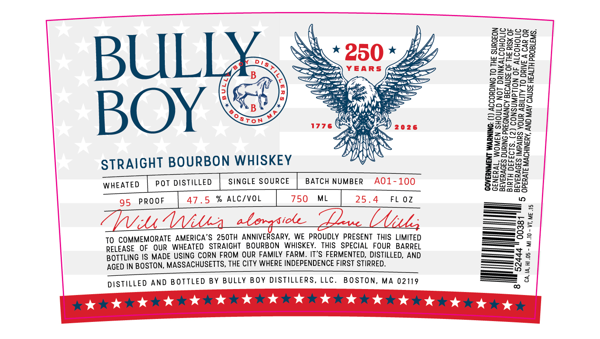

# TTB COLA Label Images - TTBID 26131001000675

**Brand Name:** BULLY BOY DISTILLERS

**Fanciful Name:** 250TH ANNIVERSARY BOTTLING

**Issue Date:** 05/15/2026

**Origin Code:** 26

**Product Class/Type:** 101

**Source:** [TTB Public COLA Registry](https://ttbonline.gov/colasonline/viewColaDetails.do?action=publicFormDisplay&ttbid=26131001000675)

## Label Images

### Label 1

## Extracted Label Text

*Text extracted via OCR - may contain errors*

**Detected Proof:** 95

### Label 1

8S

SSS

Zonoag

aS

Soxoam

Sse

Lan

INS

=

*250*

[ss

Yi

woe

Oy

82g

LIAN

=

Foo

Be

aw

<==

YEARS

<< SS

22008

ez

wes

BUL

cas =,

——

cS

Zo=

f=

Sos

Soe

AA

geogteS

ay

©

S0dS5a>

2535355

i" Woy,

32045

<sFon

N)

Sbales

S025

1776

) 2026

a= ed

2s

ose

BOY

xs)

za Nws:

Ht

Rs

S52.

Gorge

ag

HON

az

ZA)

of=o

Boss

STRAIGHT BOURBON WHISKEY

Rr

perp

Z58

oow

se

SINGLE SOURCE

BATCH NUMBER

A01-100

eres

eS

Ege

WHEATED | POT DISTILLED

omaaaS

ae

95 PROOF

47.5 % ALC/VOL

750 ML

25.4

FL OZ

—_—

a—

——"

=o

————+--]

Pu Wiles _whorgsiote. Pave Mth

>S>— 2

TO COMMEMORATE AMERICA’S 250TH ANNIVERSARY, WE PROUDLY PRESENT THIS LIMITED

———

—O

RELEASE OF OUR WHEATED STRAIGHT BOURBON WHISKEY. THIS SPECIAL FOUR BARREL

BOTTLING IS MADE USING CORN FROM OUR FAMILY FARM. IT’S FERMENTED, DISTILLED, AND

—

AGED IN BOSTON, MASSACHUSETTS, THE CITY WHERE INDEPENDENCE FIRST STIRRED.

——n

——}

==

SSS =

DISTILLED AND BOTTLED BY BULLY BOY DISTILLERS, LLC. BOSTON, MA 02119

rare a ke eae
