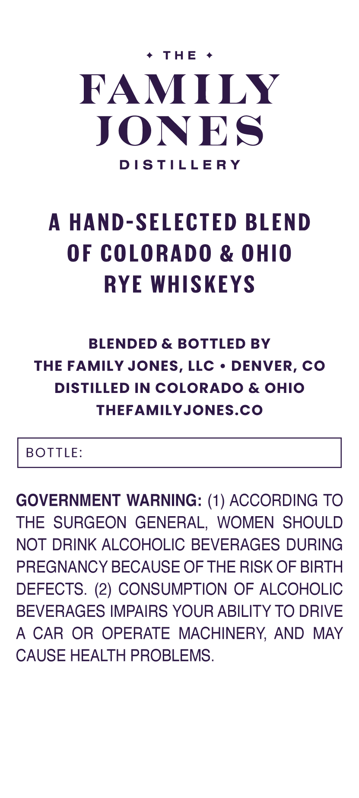
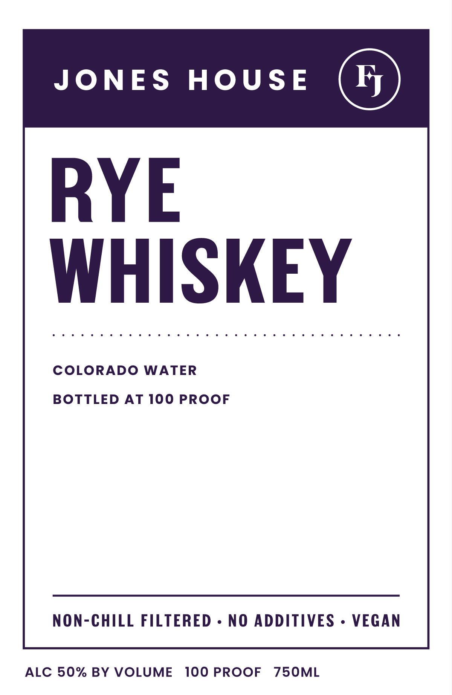

# TTB COLA Label Images - TTBID 26131001000699

**Brand Name:** JONES HOUSE

**Issue Date:** 05/27/2026

**Origin Code:** 13

**Product Class/Type:** 142

**Source:** [TTB Public COLA Registry](https://ttbonline.gov/colasonline/viewColaDetails.do?action=publicFormDisplay&ttbid=26131001000699)

## Label Images

### Back Label

### Front Label

## Extracted Label Text

*Text extracted via OCR - may contain errors*

**Detected Proof:** 100

### Back Label

ThE
FAMILY
JONES
DISTILLERY
HAND-SELECTED BLEND
OF COLORADO & OHIO
RYE WHISKEYS
BLENDED & BOTTLED BY
THE FAMILY JONES, LLC
DENVER, CO
DISTILLED IN COLORADO & OHIO
THEFAMILYJONES.CO
BOTTLE:
GOVERNMENT WARNING: (1) ACCORDING TO
THE SURGEON GENERAL, WOMEN SHOULD
NOT DRINK ALCOHOLIC BEVERAGES DURING
PREGNANCY BECAUSE OF THE RISK OF BIRTH
DEFECTS. (2) CONSUMPTION OF ALCOHOLIC
BEVERAGES IMPAIRS YOUR ABILITY TO DRIVE
A
CAR OR OPERATE MACHINERY AND
MAY
CAUSE HEALTH PROBLEMS.

### Front Label

JoNES
HOUSE
FJ
RYE
WHISKEY
COLORADO
WATER
BOTTLED
AT 100 PROOF
NoN-CHILL FILTERED _
NO ADDITIVES
VEGAN
ALC 50% BY VOLUME
100 PROOF
75OML
