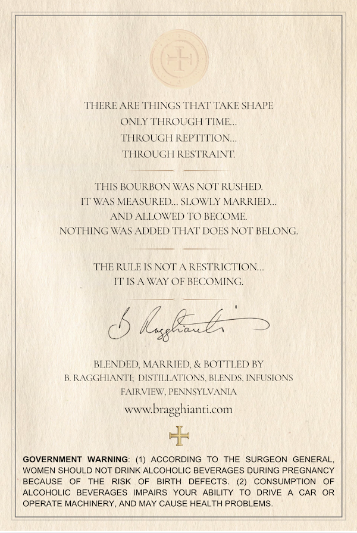
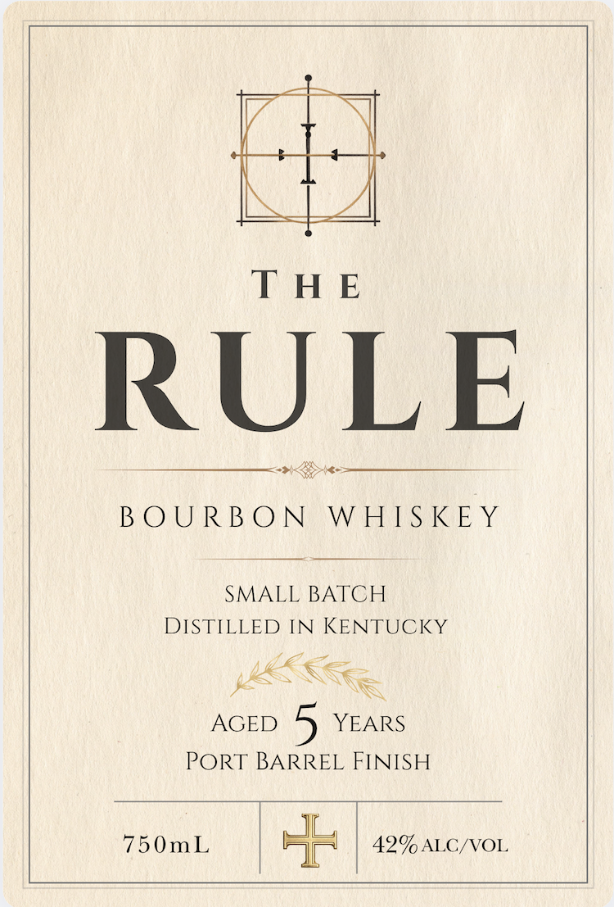

# TTB COLA Label Images - TTBID 26131001000733

**Brand Name:** THE RULE

**Issue Date:** 06/01/2026

**Origin Code:** 39

**Product Class/Type:** 141

**Source:** [TTB Public COLA Registry](https://ttbonline.gov/colasonline/viewColaDetails.do?action=publicFormDisplay&ttbid=26131001000733)

## Label Images

### Back Label

### Front Label

## Extracted Label Text

*Text extracted via OCR - may contain errors*

### Back Label

THERE ARE THINGS THAT TAKE SHAPE
ONLY THROUGH TIME_
THROUGH REPTTTION
THROUGH RESTRAINT
THIS BOURBON WAAS NO/ RUSHED
IT'WAS MEASURED SLOWLY MARRIED
AND ALLOWED TO BECOME
NOTHING WAS ADDED THAT DOES NOT BELONG
THE RULE IS NOT A RESTRICTION
TTS
WAY OF BECOMING
IGsskzze
BLENDED MARRIED & BOTTLED) BY
B RAGGHIANTI; DISTILLATIONS BLENDS INFUSTONS
FAIRVEW PENNSYLVANIA
wwwbragghianticom
GOVERNMENT
WARNING:
ACCORDING
To
THE SURGEON
GENERAL_
WOMEN SHOULD NOT DRINK ALCOHOLIC BEVERAGES DURING PREGNANCY
BECAUSE
THE
RISK
OF
BIRTH  DEFECTS:
CONSUMPTION
ALCOHOLIC
BEVERAGES
IMPAIRS
YOUR
ABILITY To
DRIVE
CAR
OR
OPERATE MACHINERY.
AND MAY CAUSE HEALTH PROBLEMS.

### Front Label

THE

RULE

HM AMOUR | EO

BOURBON WHISKEY

SMALL BATCH

DISTILLED IN KENTUCKY

JESS

RX

AGED

YEARS

PORT BARREL FINISH

750mI | rol | eam aicro
